.. _using_default_configs:

Using the Default Loadable Configurations
=========================================

The default loadable configurations have been created using the iron-skillet default and sample values. These configurations
can be loaded into Panorama or firewall for day one purposed.

.. Note::
      The values for syslog IP address, the email profile, and the config export IP address are sample information and should
      be updated specific to the user's environment.

Each directory corresponds to variations in the configuration specific to the Panorama and firewall management IP addresses:

   + sample-cloud options: management interfaces for Panorama and PAN-OS use DHCP
   + sample-mgmt-dhcp: PAN-OS default to DHCP while Panorama uses a static IP interface
   + sample-mgmt-static: both PAN-OS and Panorama use static IP Interfaces for management

Included for each type are a set command .conf file and xml full configuration file. Both include the same configurations.

SET commands
------------

This model uses traditional CLI 'copy-and-paste' to load in the configuration line by line. Users can elect to edit default
values for their specific deployment as each line is added or load the configuration as-is and then edit using the
instructions below for :ref:`gui_edits` or :ref:`cli_edits` to the default configuration.

.. Note::
      The set command conf file includes options for standard/static or dhcp management interfaces. Only load the commands specific
      to the interface type to be used.

   + get the conf file specific to the deployment type

   + log into the CLI and enter `configure` for configuration mode

   + copy set commands from the .conf file and paste into the terminal

.. Note::
      It is recommended that the user only grab 30-40 set commands per paste to avoid any buffer issues resulting in
      errors.

XML configuration file
----------------------

The templates are xml file format that have to be loaded into the device as a full config or with modular partial loading.

Instead of using scripting tools, the instructions below allow a user to ``Import`` and ``Load`` a candidate configuration
that can be manually edited by :ref:`gui_edits`or :ref:`cli_edits`.

Import the configuration file using the GUI
~~~~~~~~~~~~~~~~~~~~~~~~~~~~~~~~~~~~~~~~~~~

1. Click on the ``Device`` tab

2. Select ``Setup`` in the left nav bar

3. Click on the ``Operations`` tab

4. Then ``Import named configuration snapshot`` choosing the day one config xml file

.. Note::
    You should perform a ``Save named configuration snapshot`` as backup prior to loading the new configuration

Load the configuration
~~~~~~~~~~~~~~~~~~~~~~

1. Still under the ``Operations`` tab, use ``Load named configuration snapshot`` choosing the day one config xml file

2. Ensure no errors loading the configuration.

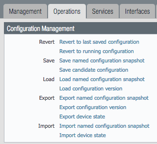

.. Note::
    If you see {{ text }} related import or load errors ensure you have the template file imported from the loadable_configs
    directory and not the templates directory.

----------------------------------------------------------------------

.. _gui_edits:

GUI variable edits
------------------

After loading the configurations using set or xml commands, users can edit specific values instead of using the
iron-skillet defaults.

The complete list of variables used by iron-skillet can be found at :ref:`creating_loadable_configs`.

----------------------------------------------------------------------

GUI variable edits: Firewall
^^^^^^^^^^^^^^^^^^^^^^^^^^^^

The steps below are for a stand-alone NGFW platform without Panorama.

**Device tab edits**

The following edits are found under the ``Device`` tab

From here the following edits can be made:

**Hostname**

1. Go to Device --> Setup --> Management

2. Click the ``gear`` icon to edit the hostname

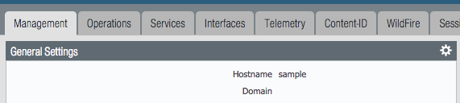

**DNS and NTP servers**

1. Go to Device --> Setup --> Services

2. Click the ``gear`` icon to edit the server values

3. Choose the Services (DNS) and NTP tabs accordingly

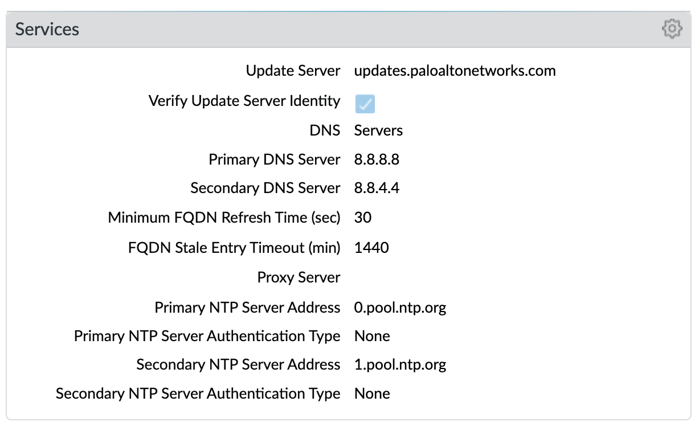

**Static Management Interface**

For a static management interface configuration, edit the IP address, subnet mask, default gateway.

1. Go to Device --> Setup --> Interfaces

2. Click on the ``Management`` link

3. Edit the management interface attributes

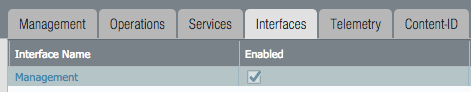

**Superuser Administrator**

The sample configuration uses the default admin/admin username and password setting. It is recommended to remove this
user and add a new superuser or at a minimum change the admin user password.

1. Go to Device --> Administrators

2. Select and delete the ``admin`` user account

3. Choose to ``Add`` a new user entering the username and password in the pop-up window

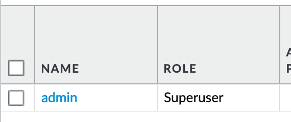

**Syslog IP Address**

Syslog is used to send traffic, threat and other log updates to an external system.

1. Go to Device --> Server Profiles --> Syslog

2. Click on the Sample_Syslog_Profile link and edit the IP address

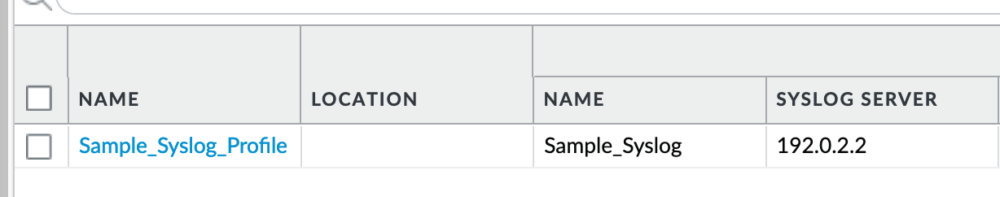

**Email Server Profile**

The email profile is used to send key alerts to select recipients.

1. Go to Device --> Server Profiles --> Email

2. Click on the Sample_Email_Profile link and edit the from, to, and gateway values in the pop-up window.

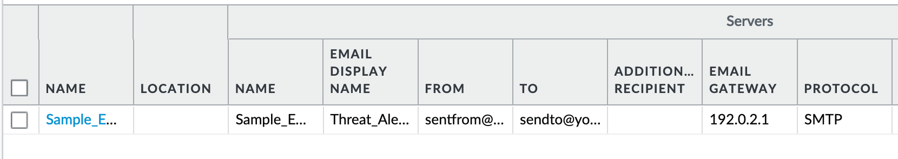

**Object tab edits**

The following edits are found under the ``Objects`` tab

From here the following edits can be made:

**Addresses**

The template uses two address objects for sinkhole values, one each for IPv4 and IPv6. These are referenced in
security rules.

1. Go to Objects --> Address

2. Click on the Sinkhole IPv4 and IPv6 links and edit the IP address

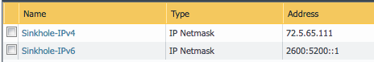

**Anti-Spyware Security Profiles**

The templates define multiple named Anti-Spyware profiles all appended with ``-AS``. Each of these profiles must be
updated with new sinkhole address if non-default values are required.

These values should match the sinkhole IP addresses configured under ``Addresses``.

1. Go to Objects --> Security Profiles --> Anti-Spyware

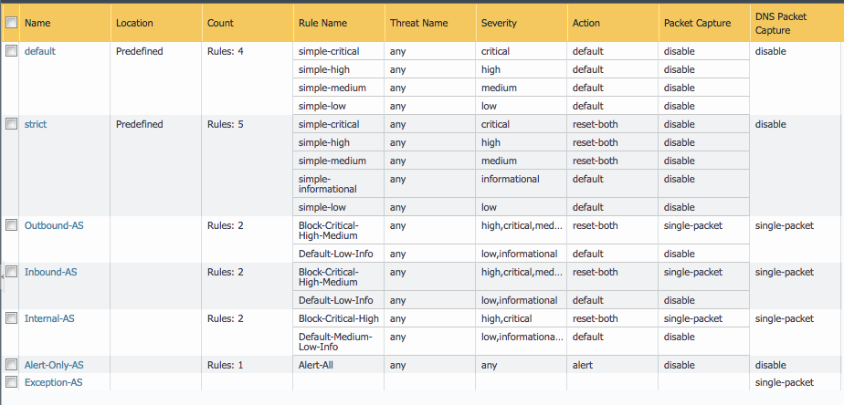

2. Click on one of the template specific profiles ending in ``-AS``

3. Click on the DNS Signatures tab and update the IPv4 and IPv6 sinkhole addresses

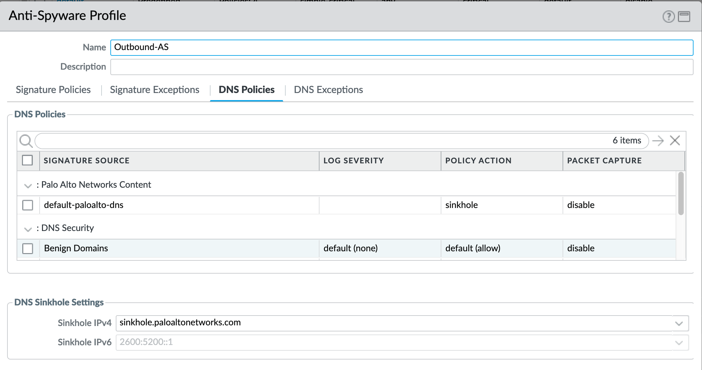

----------------------------------------------------------------------

GUI variable edits: Panorama
~~~~~~~~~~~~~~~~~~~~~~~~~~~~

The steps below are for edits to the Panorama configuration. Variable edits in the GUI will include both the Panorama
system edits and managed firewall device-group and template configurations.

**Panorama tab edits**

The following edits are found under the ``Panorama`` tab

From here the following edits can be made:

**Panorama > Hostname**

1. Go to Panorama --> Setup --> Management

2. Click the ``gear`` icon to edit the Panorama hostname

**Panorama > DNS and NTP servers**

1. Go to Panorama --> Setup --> Services

2. Click the ``gear`` icon to edit the server values

3. Choose the Services (DNS) and NTP tabs accordingly

**Panorama > Management Interface**

This configuration is specific to the Panorama management interface when statically defined.

1. Go to Panorama --> Setup --> Interfaces

2. Click on the ``Management`` link

3. Edit the management interface attributes

.. image:: images/panorama_management.png
   :width: 600

**Panorama > Superuser Administrator**

The sample configuration uses the default admin/admin username and password setting. It is recommended to remove this
user and add a new superuser or at a minimum change the admin user password.

1. Go to Panorama --> Administrators

2. Select and delete the ``admin`` user account

3. Choose to ``Add`` a new user entering the username and password in the pop-up window

**Panorama > Syslog IP Address**

Syslog is used to send traffic, threat and other log updates to an external system.

1. Go to Panorama --> Server Profiles --> Syslog

2. Click on the Sample_Syslog_Profile link and edit the IP address

**Panorama > Email Server Profile**

The email profile is used to send key alerts to select recipients.

1. Go to Panorama --> Server Profiles --> Email

2. Click on the Sample_Email_Profile link and edit the from, to, and gateway values in the pop-up window.

**Panorama > Config Bundle Export Server**

1. Go to Panorama --> Scheduled Config Export

2. Click on the Recommended_Config_Export link

3. In the pop-up window, edit the Hostname value

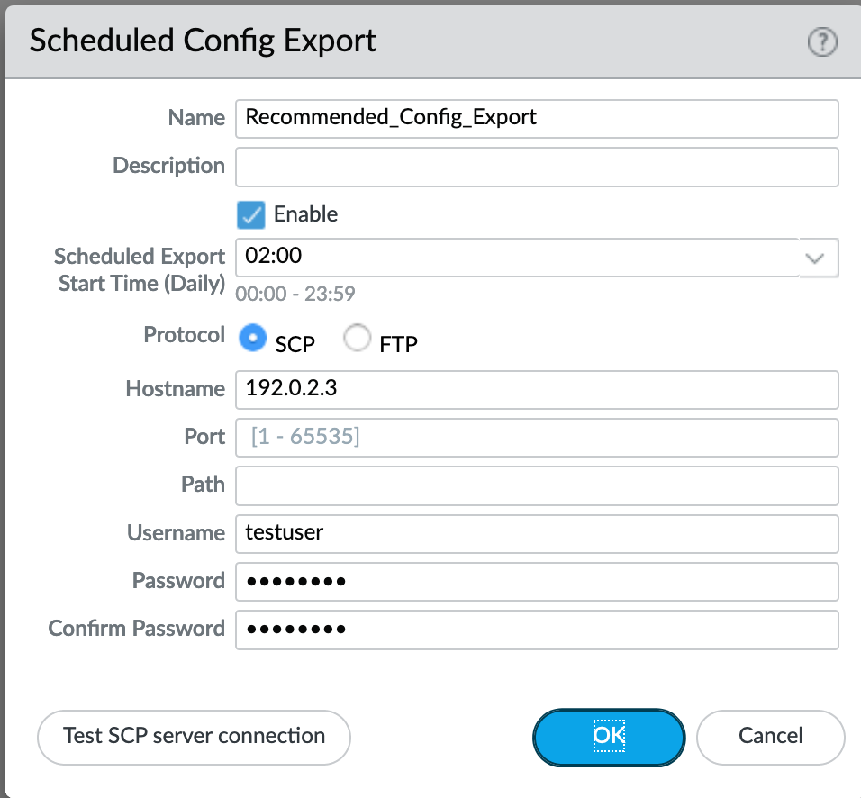

**Panorama Template**

1. Go to Panorama --> Template

2. Click on the ``sample`` link and edit the name

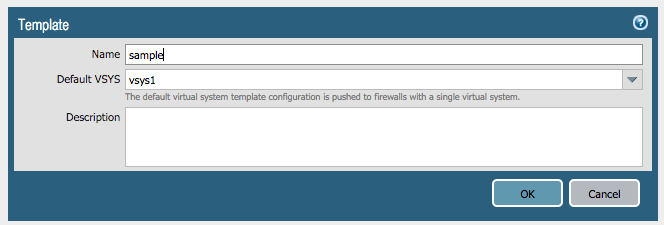

**Panorama Device-Group**

1. Go to Panorama --> Device-Groups

2. Click on the ``sample`` link and edit the name

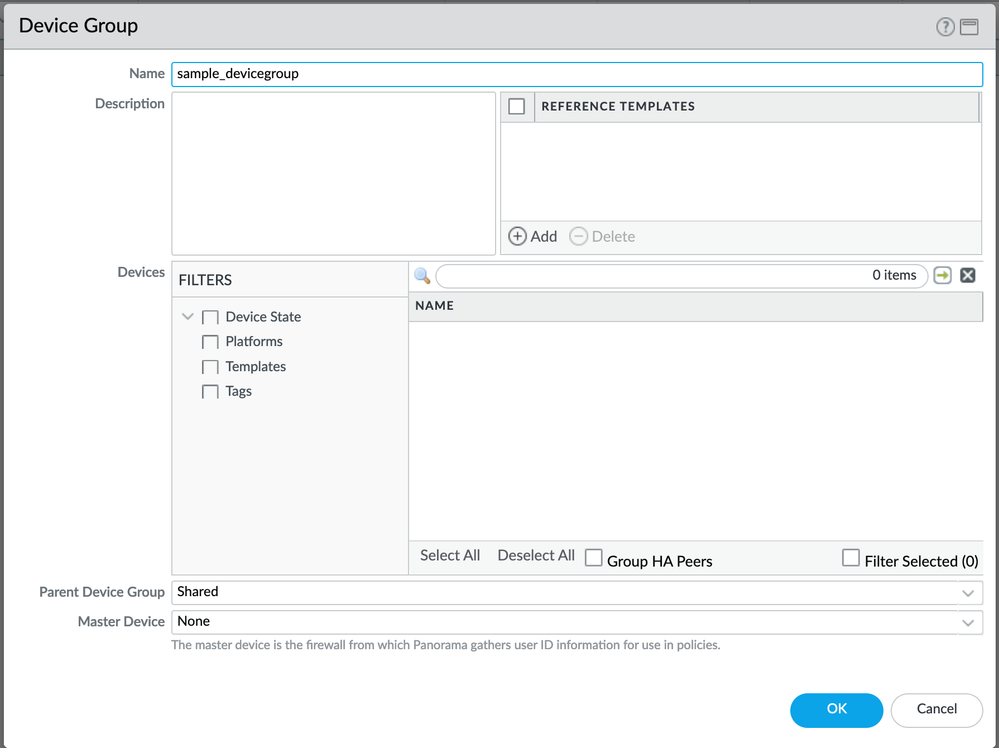

**Templates > Device tab edits**

The following edits are found under the ``Device`` tab

.. image:: images/templates_device_tab.png
   :width: 600

From here the following edits can be made:

**Hostname**

1. Go to Device --> Setup --> Management

2. Click the ``gear`` icon to edit the hostname

**DNS and NTP servers**

1. Go to Device --> Setup --> Services

2. Click the ``gear`` icon to edit the server values

3. Choose the Services (DNS) and NTP tabs accordingly

**Static Management Interface**

For a static management interface configuration, edit the IP address, subnet mask, default gateway.

1. Go to Device --> Setup --> Interfaces

2. Click on the ``Management`` link

3. Edit the management interface attributes

**Superuser Administrator**

The sample configuration uses the default admin/admin username and password setting. It is recommended to remove this
user and add a new superuser or at a minimum change the admin user password.

1. Go to Device --> Administrators

2. Select and delete the ``admin`` user account

3. Choose to ``Add`` a new user entering the username and password in the pop-up window

**Syslog IP Address**

Syslog is used to send traffic, threat and other log updates to an external system.

1. Go to Device --> Server Profiles --> Syslog

2. Click on the Sample_Syslog_Profile link and edit the IP address

**Email Server Profile**

The email profile is used to send key alerts to select recipients.

1. Go to Device --> Server Profiles --> Email

2. Click on the Sample_Email_Profile link and edit the from, to, and gateway values in the pop-up window.

**Device-Group > Objects tab edits**

----------------------------------------------------------------------

The following edits are found under the ``Objects`` tab

From here the following edits can be made:

**Addresses**

The template uses two address objects for sinkhole values, one each for IPv4 and IPv6. These are referenced in
security rules.

1. Go to Objects --> Address

2. Click on the Sinkhole IPv4 and IPv6 links and edit the IP address

**Anti-Spyware Security Profiles**

The templates define multiple named Anti-Spyware profiles all appended with ``-AS``. Each of these profiles must be
updated with new sinkhole address if non-default values are required.

These values should match the sinkhole IP addresses configured under ``Addresses``.

1. Go to Objects --> Security Profiles --> Anti-Spyware

2. Click on one of the template specific profiles ending in ``-AS``

3. Click on the DNS Signatures tab and update the IPv4 and IPv6 sinkhole addresses

------------------------------------------------------------------------------------

.. _cli_edits:

CLI variable edits
------------------

After loading the configurations using set or xml commands, users can edit specific values instead of using the
iron-skillet defaults.

The complete list of variables used by iron-skillet can be found at :ref:`creating_loadable_configs`.

CLI variable edits: Firewall
^^^^^^^^^^^^^^^^^^^^^^^^^^^^

This section is specific to a non-Panorama managed NGFW.

Instead of using the GUI to make template edits for each variable value, below are steps using SET commands to make
the same candidate configuration changes.

The {{ text }} values denotes where a variable is used in the template.

**Hostname**

::

   set deviceconfig system hostname {{ hostname }}

**DNS and NTP Servers**

::

   set deviceconfig system dns-setting servers primary {{ DNS 1 }} secondary {{ DNS 2 }}
   set deviceconfig system ntp-servers primary-ntp-server ntp-server-address {{ NTP 1 }}
   set deviceconfig system ntp-servers secondary-ntp-server ntp-server-address {{ NTP 2 }}

**Static management interface**

::

   set deviceconfig system ip-address {{ ip address }} netmask {{ mask }} default-gateway {{ gateway }}

**Superuser admin account**

::

   set mgt-config users {{ username }} permissions role-based superuser yes
   set mgt-config users {{ username }} password

When the password command is entered, the user will be prompted for a password.

**Syslog and Email Server Profiles**

::

   set shared log-settings syslog Sample_Syslog_Profile server Sample_Syslog server {{ ip address }}
   set shared log-settings email Sample_Email_Profile server Sample_Email_Profile from {{ from }}
   set shared log-settings email Sample_Email_Profile server Sample_Email_Profile to {{ to }}
   set shared log-settings email Sample_Email_Profile server Sample_Email_Profile gateway {{ address }}

**Address Objects**

::

   set address Sinkhole-IPv4 ip-netmask {{ IPv4 address }}
   set address Sinkhole-IPv6 ip-netmask {{ IPv6 address }}

**Anti-Spyware Security Profiles**

The same commands are used across all of the template security profiles ending in ``-AS``.

::

   set profiles spyware {{ profile name }} botnet-domains sinkhole ipv4-address {{ IPv4 address }}
   set profiles spyware {{ profile name }} botnet-domains sinkhole ipv6-address {{ IPv6 address }}

----------------------------------------------------------------------------------------------

CLI variable edits: Panorama
^^^^^^^^^^^^^^^^^^^^^^^^^^^^

This section is specific to configuration of a Panorama management system.

Instead of using the GUI to make template edits for each variable value, below are steps using SET commands to make
the same candidate configuration changes.

The {{ text }} values denotes where a variable is used in the template.

.. Note::
   The initial configurations are specific to the Panorama platform itself. The managed firewall configurations
   are added under the template and device-group configurations.

**Panorama > Hostname**

::

   set deviceconfig system hostname {{ hostname }}

**Panorama > DNS and NTP Servers**

::

   set deviceconfig system dns-setting servers primary {{ DNS 1 }} secondary {{ DNS 2 }}
   set deviceconfig system ntp-servers primary-ntp-server ntp-server-address {{ NTP 1 }}
   set deviceconfig system ntp-servers secondary-ntp-server ntp-server-address {{ NTP 2 }}

**Panorama > Static management interface**

::

   set deviceconfig system ip-address {{ ip address }} netmask {{ mask }} default-gateway {{ gateway }}

**Panorama > Superuser admin account**

::

   set mgt-config users {{ username }} permissions role-based superuser yes
   set mgt-config users {{ username }} password

When the password command is entered, the user will be prompted for a password.

**Panorama > Syslog and Email Server Profiles**

::

   set panorama log-settings syslog Sample_Syslog_Profile server Sample_Syslog server {{ ip address }}
   set panorama log-settings email Sample_Email_Profile server Sample_Email_Profile from {{ from }}
   set panorama log-settings email Sample_Email_Profile server Sample_Email_Profile to {{ to }}
   set panorama log-settings email Sample_Email_Profile server Sample_Email_Profile gateway {{ address }}

**Panorama > Config Bundle Export Schedule**

::

   set deviceconfig system config-bundle-export-schedule Recommended_Config_Export protocol scp hostname {{ ip address }}

------------------------------------------------------------------------------------------------------------------

.. Note::
   The configuration for Panorama has some element in the iron-skillet shared template and others specific to the device
   captured as a template-stack called sample_stack. The same is true for device-group items that are either shared
   or contained in a device-specific group, namely reports.

**Template > Hostname**

::

   set template-stack sample_stack config deviceconfig system hostname {{ hostname }}

**Template > DNS and NTP Servers**

::

   set template iron-skillet config deviceconfig system dns-setting servers primary {{ DNS 1 }} secondary {{ DNS 2 }}
   set template iron-skillet config deviceconfig system ntp-servers primary-ntp-server ntp-server-address {{ NTP 1 }}
   set template iron-skillet config deviceconfig system ntp-servers secondary-ntp-server ntp-server-address {{ NTP 2 }}

**Template > Static management interface**

This is to be configured for a firewall with a static management interface.

::

   set template-stack sample_stack config deviceconfig system ip-address {{ ip address }}
   set template-stack sample_stack config deviceconfig system netmask {{ mask }}
   set template-stack sample_stack config deviceconfig system default-gateway {{ gateway }}

**Template > Superuser admin account**

::

   set template iron-skillet config mgt-config users {{ username }} permissions role-based superuser yes
   set template iron-skillet config mgt-config users {{ username }} password

When the password command is entered, the user will be prompted for a password.

**Template > Syslog and Email Server Profiles**

::

   set template iron-skillet config shared log-settings syslog Sample_Syslog_Profile server Sample_Syslog server {{ ip address }}
   set template iron-skillet config shared log-settings email Sample_Email_Profile server Sample_Email_Profile from {{ from }}
   set template iron-skillet config shared log-settings email Sample_Email_Profile server Sample_Email_Profile to {{ to }}
   set template iron-skillet config shared log-settings email Sample_Email_Profile server Sample_Email_Profile gateway {{ address }}

**Device-Group > Address Objects**

::

   set shared address Sinkhole-IPv4 ip-netmask {{ IPv4 address }}
   set shared address Sinkhole-IPv6 ip-netmask {{ IPv6 address }}

**Device-Group Anti-Spyware Security Profiles**

The same commands are used across all of the templated security profiles ending in ``-AS``.

::

   set shared profiles spyware {{ profile name }} botnet-domains sinkhole ipv4-address {{ IPv4 address }}
   set shared sample profiles spyware {{ profile name }} botnet-domains sinkhole ipv6-address {{ IPv6 address }}
