GUI Visual Guide: PAN-OS
========================

IronSkillet is delivered as a configuration template without a step-by-step configuration guide.
This was the intent to have a rapid deployment option without massive GUI clicks.

However, users still want to know what exactly they configured in the event they want to make
changes or compare IronSkillet manually to their existing configuration.

So based on popular demand here is the GUI-based visual guide to all of the IronSkillet configuration elements.

This is based on PAN-OS 9.x with callouts for any features not supported in the 8.x releases.
Also note that based on software release, there may be other items configured or ‘checked’ as defaults and not part of IronSkillet.
These items are not referenced in this guide.

IronSkillet includes a mix of day one best practices for configuration types such as:

    + **Device management hardening**: general operations of the NGFW
    + **Security traffic hardening**: control of traffic flows that impacts device monitoring
    + **Logging and alerts**: data collection and external notifications
    + **Security objects and policies**: policy-related config settings and dynamic updates
    + **Decryption objects and policies**: certification checks and sample no-decrypt policy

This visual guide is based on the `IronSkillet full configuration file`_

.. _IronSkillet full configuration file: https://github.com/PaloAltoNetworks/iron-skillet/blob/panos_v9.0/loadable_configs/sample-mgmt-static/panos/iron_skillet_panos_full.xml

This file uses default value settings and can be readily imported and loaded as a candidate configuration allowing the user to follow along with this guide.

.. Note::
    Documentation links for release 9.0 are provided for additional information.

Device
------

The device tab is used for device management, hardening, system logging, and other device related configuration elements.

It also includes security function related configuration such as dynamic updates for anti-virus, vulnerability,
spyware DNS and Wildfire signatures as well as Wildfire submission file size configuration.

Setup
^^^^^

Management
~~~~~~~~~~

.. _Device - Setup - Management: https://docs.paloaltonetworks.com/pan-os/9-0/pan-os-web-interface-help/device/device-setup-management.html

.. admonition:: See also

     General configuration information in the Admin Guide: `Device - Setup - Management`_

Device > Setup > Management > General Settings
++++++++++++++++++++++++++++++++++++++++++++++

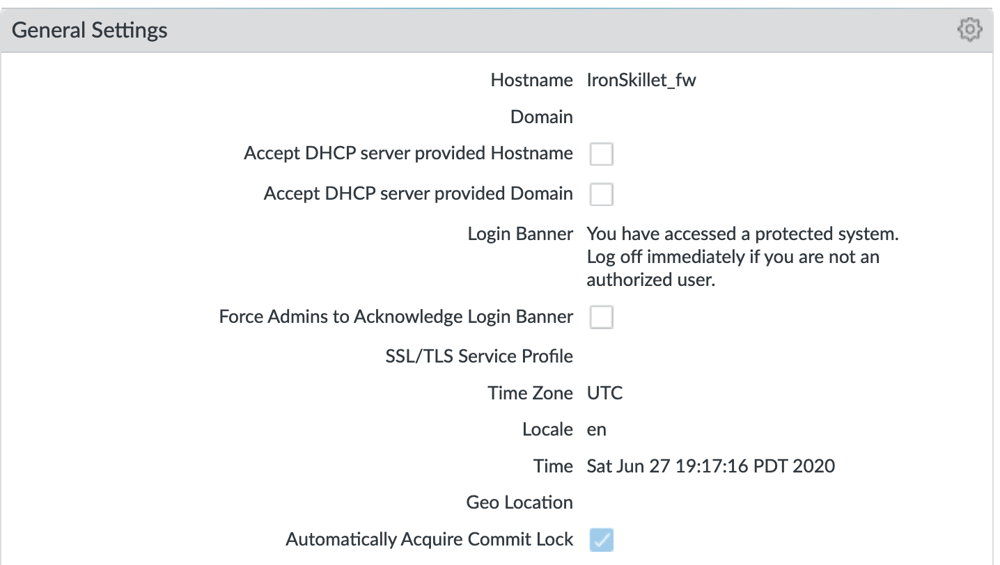

Changes to General Settings:

    + **Hostname**: name of the device; IronSkillet defaults to ‘sample’
    + **Login Banner**: display text presented to users at login
    + **Time Zone**: set to UTC so all devices map to a common universal timezone
    + **Automatically Acquire Commit Lock**: block a commit across multiple web sessions

Device > Setup > Management > Authentication Settings
+++++++++++++++++++++++++++++++++++++++++++++++++++++

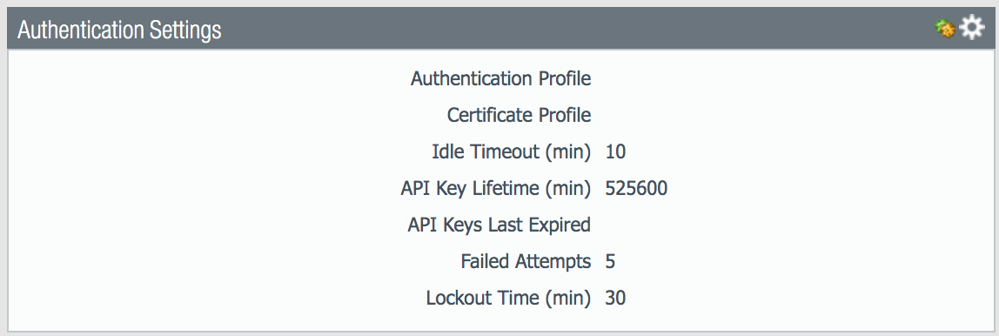

Changes to Authentication Settings:

    + **Idle Timeout**: close the session after 10 minutes of inactivity
    + **API Key Lifetime (9.0)**: time to expire an existing API key; ‘infinite’ pre 9.0
    + **Failed Attempts**: Lockout the account after 5 failed attempts
    + **Lockout Time**: Lockout the account for 30 minutes after 5 failed attempts

Device > Setup > Management > Logging and Reporting Settings
++++++++++++++++++++++++++++++++++++++++++++++++++++++++++++

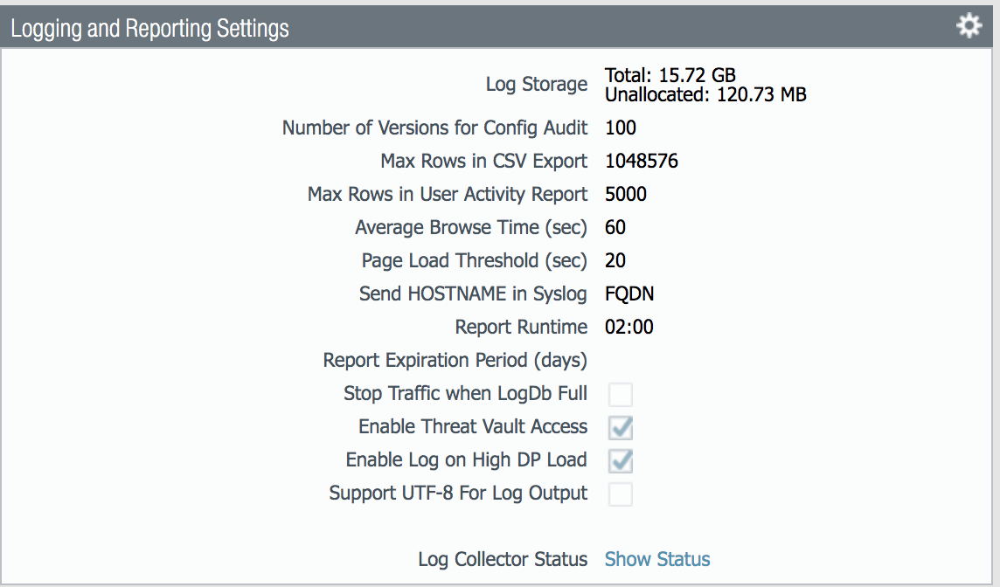

Changes to Logging and Reporting Settings:

    + **Max Rows in CSV Export**: increase row count to 1,048,576
    + **Enable Log on High DP Load**: a system log entry is generated when the packet processing load on the firewall is at 100% CPU utilization

Log Suppression (CLI only)
++++++++++++++++++++++++++

Log suppression, when enabled, is a feature that instructs the Palo Alto Networks device to combine multiple similar logs into a single log entry 
on the Monitor > Logs > Traffic page. 

Disabled to ensure unique log entries even if similar session types

::

   set deviceconfig setting logging log-suppression no

Device > Setup > Management > Minimum Password Complexity
+++++++++++++++++++++++++++++++++++++++++++++++++++++++++

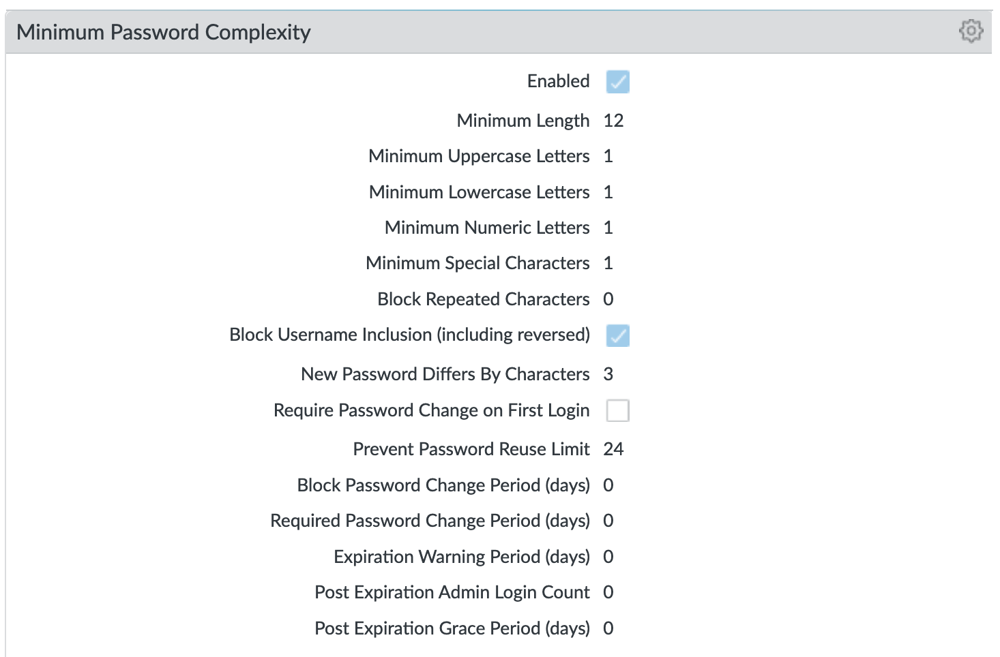

Enable minimum password requirements for local accounts.
With this feature, you can ensure that local administrator accounts on the firewall will adhere to a defined set of password requirements.

.. Note::
    password expiration has been removed based on NIST standards although users can still opt to set an expiration and
    notification period

Operations
~~~~~~~~~~

.. _Device - Setup - Operations: https://docs.paloaltonetworks.com/pan-os/9-0/pan-os-web-interface-help/device/device-setup-operations.html

.. admonition:: See also

     General configuration information in the Admin Guide: `Device - Setup - Operations`_

Device > Setup > Operations > SNMP Setup
++++++++++++++++++++++++++++++++++++++++

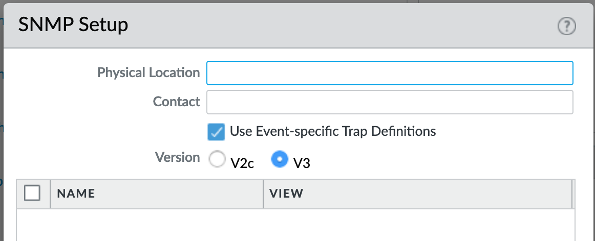

If used, ensure SNMP version is V3

Services
~~~~~~~~

.. _Device - Setup - Services: https://docs.paloaltonetworks.com/pan-os/9-0/pan-os-web-interface-help/device/device-setup-services.html

.. admonition:: See also

     General configuration information in the Admin Guide: `Device - Setup - Services`_

Device > Setup > Services > Services
++++++++++++++++++++++++++++++++++++

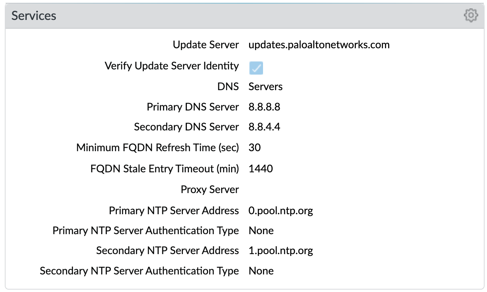

Key configuration elements:

    + **DNS**: Primary and Secondary server IP addresses; for all DNS queries that the firewall initiates in support of FQDN address objects, logging, and firewall management
    + **NTP**: Primary and Secondary server FQDNs; use to synchronize the clock on the firewall

Interfaces
~~~~~~~~~~

.. _Device - Setup - Interfaces: https://docs.paloaltonetworks.com/pan-os/9-0/pan-os-web-interface-help/device/device-setup-interfaces.html

.. admonition:: See also

     General configuration information in the Admin Guide: `Device - Setup - Interfaces`_

Device > Setup > Interfaces > Management
++++++++++++++++++++++++++++++++++++++++

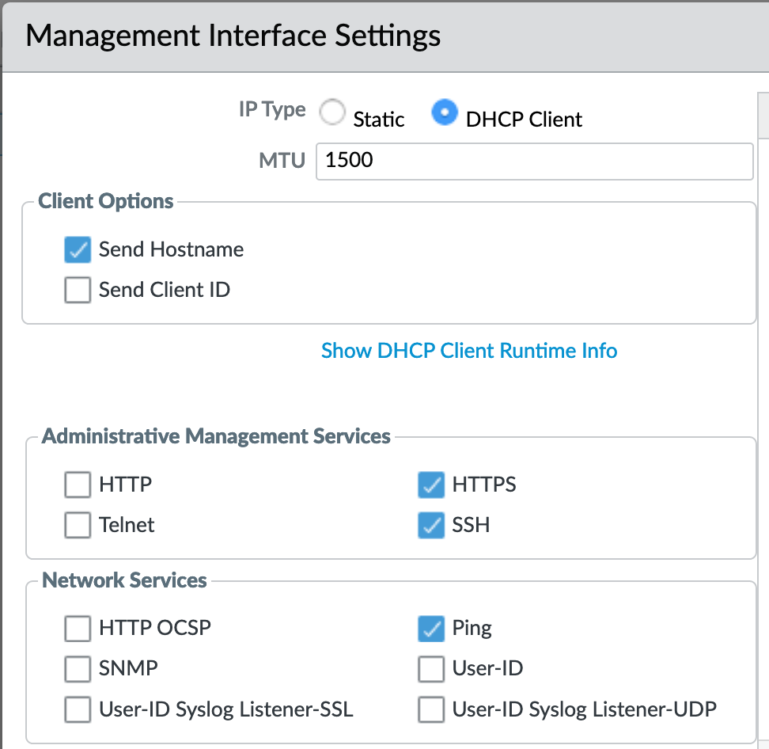

This example shows a static IP address, netmask, and gateway configuration.
IronSkillet also gives the option of using the DHCP Client which removes the IP data fields.

    + **Administrative Management Services**: limit to HTTPS and SSH
    + **Network Services**: only allow Ping unless other services are required

Telemetry
~~~~~~~~~

.. _Device - Setup - Telemetry: https://docs.paloaltonetworks.com/pan-os/9-0/pan-os-web-interface-help/device/device-setup-telemetry.html

.. admonition:: See also

     General configuration information in the Admin Guide: `Device - Setup - Telemetry`_

Device > Setup > Telemetry > Telemetry
++++++++++++++++++++++++++++++++++++++

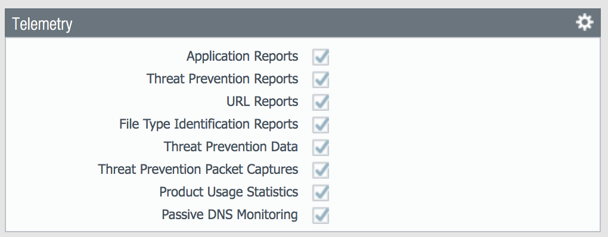

IronSkillet sets all telemetry optons to enabled.

Telemetry is the process of collecting and transmitting data for analysis. 
When you enable telemetry on the firewall, the firewall collects and forwards data that includes information on applications, 
threats, device health, and passive DNS to Palo Alto Networks. All Palo Alto Networks users benefit 
from the data that each telemetry participant shares, making telemetry a community-driven approach to threat prevention. 

Telemetry is an opt-in feature and, for most telemetry data, you can preview the information that the firewall collects. 
Palo Alto Networks does not share your telemetry data with other customers or third-party organizations.

Content-ID
~~~~~~~~~~

.. _Device - Setup - Content-ID: https://docs.paloaltonetworks.com/pan-os/9-0/pan-os-web-interface-help/device/device-setup-content-id.html

.. admonition:: See also

     General configuration information in the Admin Guide: `Device - Setup - Content-ID`_

Device > Setup > Content-ID > Content-ID Settings
+++++++++++++++++++++++++++++++++++++++++++++++++

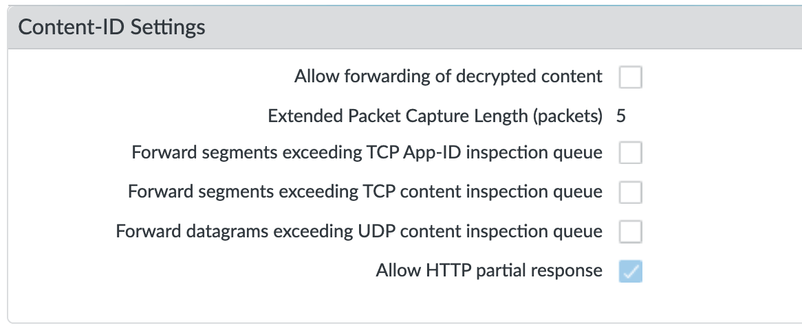

**Disable Forward segments exceeding TCP App-ID inspection queue**:
In newer releases disabled by default; explicit disable in IronSkillet template
Disable this option to prevent the firewall from forwarding TCP segments and skipping App-ID inspection when the App-ID inspection queue is full.

**Disable Forward segments exceeding TCP content inspection queue**:
Disable this option to prevent the firewall
from forwarding TCP segments and skipping content inspection when the content inspection queue is full.

**Disable Forward segments exceeding UDP content inspection queue**:
Disable this option to prevent the firewall from forwarding UDP segments and skipping content inspection when the content inspection queue is full. 

**Disable Allow HTTP partial response**
This option allows a client to fetch only part of a file. When a next-generation firewall in the path of a transfer identifies and drops a malicious file, 
it terminates the TCP session with an RST packet. If the web browser implements the HTTP Range option, it can start a new session to fetch only the 
remaining part of the file. This prevents the firewall from triggering the same signature again due to the lack of context into the initial session, 
while at the same time allowing the web browser to reassemble the file and deliver the malicious content. To prevent this, make sure this option is disabled.

Device > Setup > Content-ID > X-Forwarded-For Headers
+++++++++++++++++++++++++++++++++++++++++++++++++++++

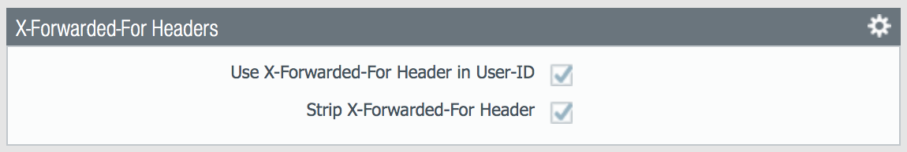

Header field option that preserves the IP address of the user who made the GET request

**Enable Use X-Forwarded-For Header in User-ID**

Select this option to specify that User-ID reads IP addresses from the X-Forwarded-For (XFF) header in client requests for web services when the firewall
is deployed between the Internet and a proxy server that would otherwise hide client IP addresses. User-ID matches the IP addresses it reads with usernames 
that your policies reference so that those policies can control and log access for the associated users and groups. If the header has multiple IP addresses, 
User-ID uses the first entry from the left.

**Enable Strip X-Forwarded-For Header**

Select this option to remove the X-Forwarded-For (XFF) header, which contains the IP address of a client requesting a web service when the firewall is
deployed between the Internet and a proxy server. The firewall zeroes out the header value before forwarding the request: the forwarded packets don’t 
contain internal source IP information.

Wildfire
~~~~~~~~

.. _Device - Setup - Wildfire: https://docs.paloaltonetworks.com/pan-os/9-0/pan-os-web-interface-help/device/device-setup-wildfire.html

.. admonition:: See also

     General configuration information in the Admin Guide: `Device - Setup - Wildfire`_

Device > Setup > Wildfire > General Settings
++++++++++++++++++++++++++++++++++++++++++++

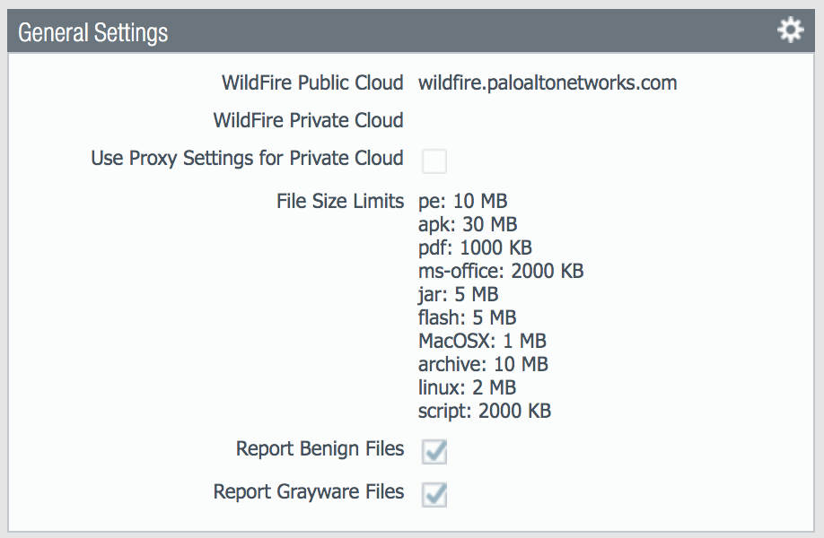

Key configuration elements:

    + **WildFire Public Cloud**: where to send file samples for analysis; defaults to the US-based url and can be changed to various regional sites
    + **File Size Limits**: recommended maximum file sizes to send to WildFire
    + **Report Benign/Grayware Files**: shows these verdicts in the Wildfire submissions logs

.. _wildfire global cloud documentation: https://docs.paloaltonetworks.com/wildfire/9-0/wildfire-admin/wildfire-overview/wildfire-deployments/wildfire-global-cloud.html#

.. admonition:: See also

    The `wildfire global cloud documentation`_ has additional information for public cloud fqdn options

Session
~~~~~~~~

Configure session age-out times, decryption certificate settings, and global session-related settings such as firewalling 
IPv6 traffic and rematching Security policy to existing sessions when the policy changes.

.. _Device - Setup - Session: https://docs.paloaltonetworks.com/pan-os/9-0/pan-os-web-interface-help/device/device-setup-session.html

.. admonition:: See also

     General configuration information in the Admin Guide: `Device - Setup - Session`_

Device > Setup > Session > Session Settings
+++++++++++++++++++++++++++++++++++++++++++

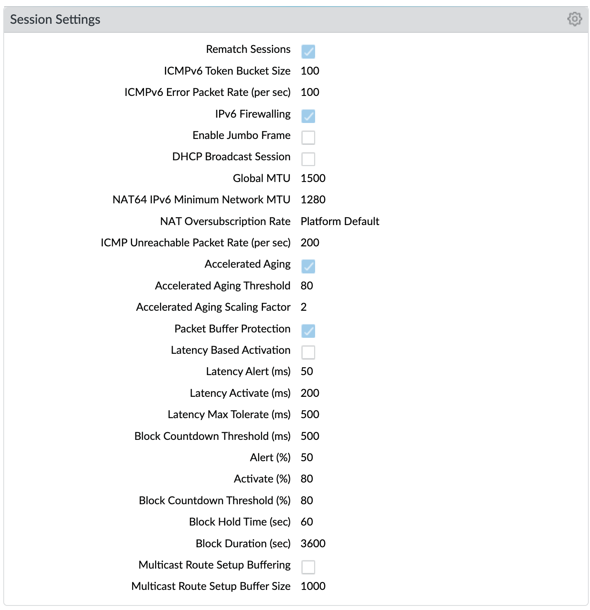

Key configuration elements:

    + **Rematch Sessions**: cause the firewall to apply newly configured security policies to sessions that are already in progress

Device > Setup > Session > TCP Settings
+++++++++++++++++++++++++++++++++++++++++++

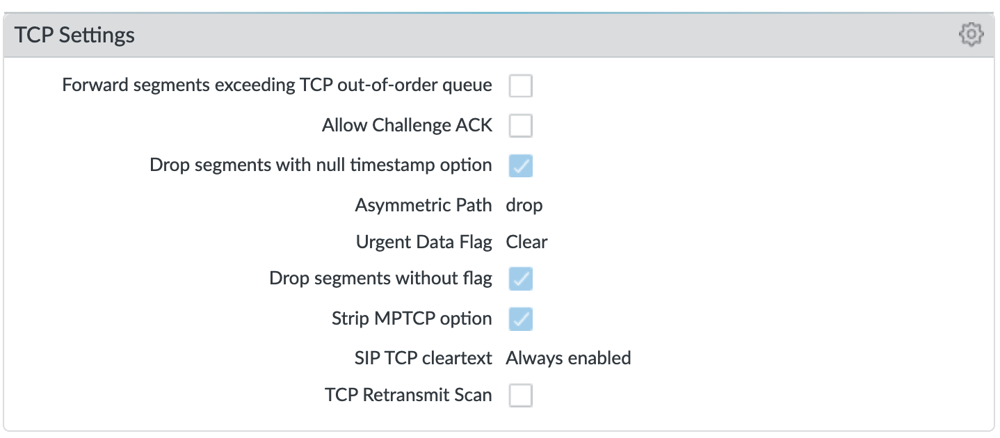

Prevent TCP and MPTCP evasions

    + set **Forward segments exceeding TCP out-of-order queue** to ‘no’
    + set **Drop segments with null timestamp option** to ‘yes’
    + set **urgent data flag** to ‘clear’
    + set **drop segments without flag** to ‘yes’
    + set **Strip MPTCP option** to ‘yes’

Administrators
^^^^^^^^^^^^^^

IronSkillet default admin
~~~~~~~~~~~~~~~~~~~~~~~~~

.. _Device - Administrators: https://docs.paloaltonetworks.com/pan-os/9-0/pan-os-web-interface-help/device/device-administrators.html

.. admonition:: See also

     General configuration information in the Admin Guide: `Device - Administrators`_

Device > Administrators : admin
+++++++++++++++++++++++++++++++

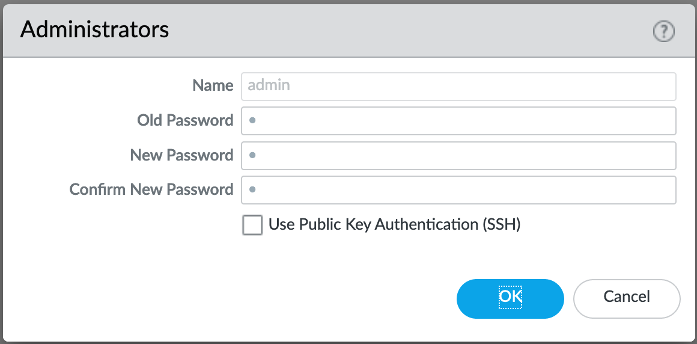

The default reference configuration uses the default admin/admin login credentials. This should be changed immediately.

.. Note::
    As of release 9.0.4 the user is forced to change the admin password based on a minimum character length of 8 as part of a
    default password complexity profile. Once IronSkillet is loaded, this complexity profile is more complex overriding the default profile.

Response Pages
^^^^^^^^^^^^^^

Response pages are the web pages that display when a user tries to access a URL.

.. _Device - Response Pages: https://docs.paloaltonetworks.com/pan-os/9-0/pan-os-web-interface-help/device/device-response-pages.html

.. admonition:: See also

     General configuration information in the Admin Guide: `Device - Response Pages`_

IronSkillet Enable Block Page
~~~~~~~~~~~~~~~~~~~~~~~~~~~~~

Device > Response Pages > Application Block Page
++++++++++++++++++++++++++++++++++++++++++++++++

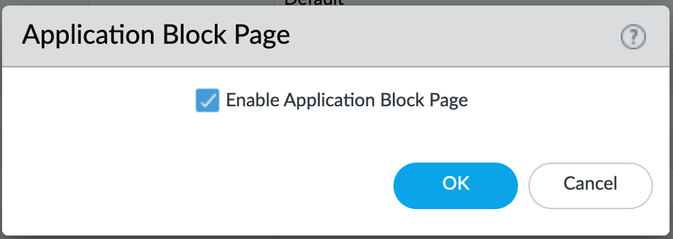

Response pages display when a user attempts to access a URL that is not permitted by policy or content (threat) inspection
It is recommended to enable the **Application Block Page** setting so that users are aware of why an application is not working.

Log Settings
^^^^^^^^^^^^

.. _Device - Log Settings: https://docs.paloaltonetworks.com/pan-os/9-0/pan-os-web-interface-help/device/device-log-settings.html

.. admonition:: See also

     General configuration information in the Admin Guide: `Device - Log Settings`_

There are multiple sections that can be configured for device log forwarding (System, Configuration, User-ID, and HIP Match)

Options include sending all logs, logs by severity, and custom attributes using the filter builder.
Iron Skillet recommended settings include forwarding critical system logs to email and using Syslog for all system logs

Configuration, User-ID, and HIP Match should forward all logs to syslog

It is recommended to forward all logs to Panorama if the firewall is being managed by Panorama.
This setting is unchecked as the Iron Skillet configuration assumes a standalone configuration

.. Note::
    Since log settings are operational and may vary across user environments, these are focused as
    ‘reference configurations’ as part of a recommended day one starter configuration.

System
~~~~~~

System event log actions

Device > Log Settings > System
++++++++++++++++++++++++++++++

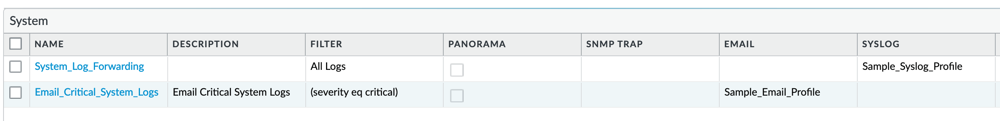

**Email_Critical_System_Logs**: Send output as an email using a configured email profile. Only email severity=critical events

**System_Log_Forwarding**: As reference, forward all system logs as syslog using a configured syslog profile

Profiles configurations are in the section :ref:`Server Profiles`. 

Configuration
~~~~~~~~~~~~~

Configuration event log actions

Device > Log Settings > Configuration
+++++++++++++++++++++++++++++++++++++

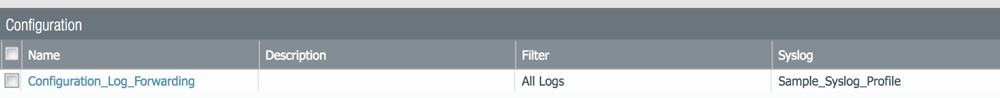

**Configuration_Log_Forwarding**: As reference, forward all configuration logs as syslog using a configured syslog profile

Profiles configurations are in the section :ref:`Server Profiles`.

User-ID
~~~~~~~

User-ID event log actions

Device > Log Settings > User-ID
+++++++++++++++++++++++++++++++

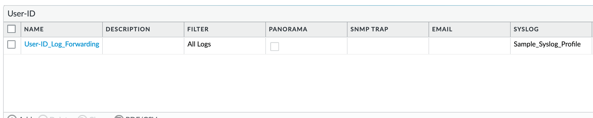

**User-ID_Log_Forwarding**: As reference, forward all user ID logs as syslog using a configured syslog profile

Profiles configurations are in the section :ref:`Server Profiles`. 

Host Information Profile (HIP) Match
~~~~~~~~~~~~~~~~~~~~~~~~~~~~~~~~~~~~

GlobalProtect HIP event log actions

Device > Log Settings > HIP Match
+++++++++++++++++++++++++++++++++

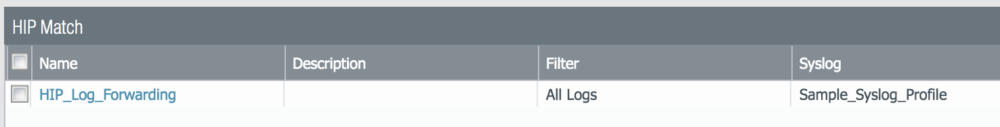

**HIP_Log_Forwarding**

As reference, forward all HIP logs as syslog using a configured syslog profile

Profiles configurations are in the section :ref:`Server Profiles`.  

.. _Server Profiles:

Server Profiles
^^^^^^^^^^^^^^^

.. _Device - Server Profiles: https://docs.paloaltonetworks.com/pan-os/9-0/pan-os-web-interface-help/device/device-server-profiles.html

.. admonition:: See also

     General configuration information in the Admin Guide: `Device - Server Profiles`_

.. Note::
    Since are operational and may vary across user environments, these are focused as ‘reference configurations’ as part of a 
    recommended day one starter configuration.

.. Note::
    These values will need to be adjusted to the actual customer environment settings.
    You will want to verify that the Email Relay and Syslog machine can receive messages
    from the firewalls management interface (default **Service Route Configuration – Device > Setup > Services**).

Configuration of server profiles used by the log setting configurations.

Syslog
~~~~~~

Device > Server Profiles > Syslog
+++++++++++++++++++++++++++++++++

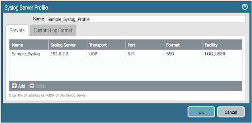

Sample Syslog Profile using standard port 514.

.. Note::
    The sample IP address 192.0.2.2 is a non-routable address

Email Server
~~~~~~~~~~~~

Device > Server Profiles > Email
++++++++++++++++++++++++++++++++

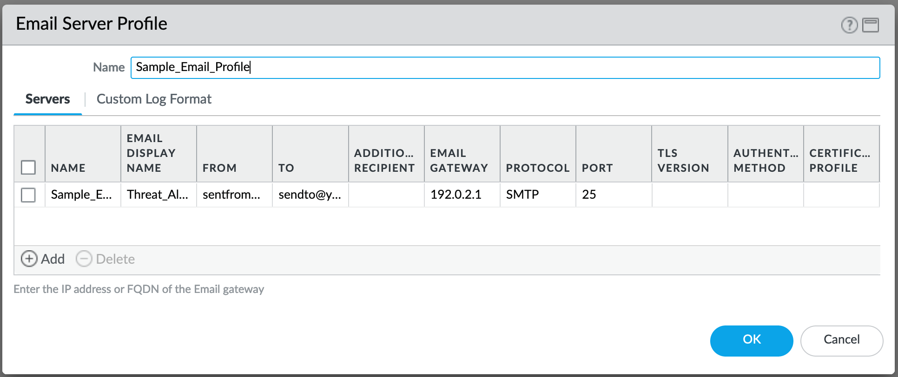

Sample email server profile for critical alert events.

.. Note::
    the from/to and gateway values are reference only. The gateway address is non-routable.

Dynamic Updates
^^^^^^^^^^^^^^^

.. _Device - Dynamic Updates: https://docs.paloaltonetworks.com/pan-os/9-0/pan-os-web-interface-help/device/device-dynamic-updates.html

.. admonition:: See also

     General configuration information in the Admin Guide: `Device - Dynamic Updates`_

IronSkillet Dynamic Updates
~~~~~~~~~~~~~~~~~~~~~~~~~~~

Dynamic updates allow the firewall to periodically check for content updates. Without this schedule configured, no new signature, 
vulnerabilities, malicious domains, or GlobalProtect files will be locally loaded into the firewall.

Device > Dynamic Updates : schedules
++++++++++++++++++++++++++++++++++++

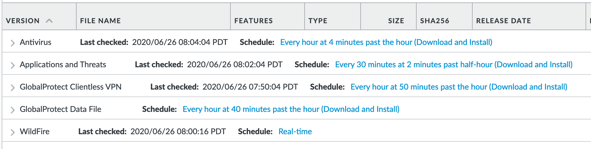

Updates are configured with minimum time values to ensure new content loads are applied when available. 
They are also installed at the time of download.

Time schedules are varied around the hour to avoid download/install overlap between update types.

Antivirus
~~~~~~~~~
Includes new and updated antivirus signatures, including signatures discovered by WildFire. You must have a Threat Prevention 
subscription to get these updates. New antivirus signatures are published daily.

Applications and Threats
~~~~~~~~~~~~~~~~~~~~~~~~
Includes new and updated application and threat signatures. This update is available if you have a Threat Prevention subscription 
(and in this case you will get this update instead of the Applications update). New Applications and Threats updates are published weekly. 
This means that the latest content update always includes the application and threat signatures released in previous versions.

WildFire
~~~~~~~~
Provides near real-time malware and antivirus signatures created as a result of the analysis done by the WildFire public cloud. 
WildFire signature updates are made available every five minutes. You can set the firewall to check for new updates as frequently 
as every minute to ensure that the firewall retrieves the latest WildFire signatures within a minute of availability. 
Without the WildFire subscription, you must wait 24 to 48 hours for the WildFire signatures to roll into the Applications and Threat update. 

GlobalProtect Clientless VPN
~~~~~~~~~~~~~~~~~~~~~~~~~~~~
Contains new and updated application signatures to enable Clientless VPN access to common web applications from the GlobalProtect portal. 
You must have a GlobalProtect subscription to receive these updates. In addition, you must create a schedule for these updates before 
GlobalProtect Clientless VPN will function.

GlobalProtect Data File
~~~~~~~~~~~~~~~~~~~~~~~
Contains the vendor-specific information for defining and evaluating host information profile (HIP) data returned by GlobalProtect apps. 
You must have a GlobalProtect gateway subscription in order to receive these updates. In addition, you must create a schedule for these 
updates before GlobalProtect will function.

Network
-------

Network Profiles
^^^^^^^^^^^^^^^^

.. _Network - Network Profiles: https://docs.paloaltonetworks.com/pan-os/9-0/pan-os-web-interface-help/network/network-network-profiles.html

.. admonition:: See also

     General configuration information in the Admin Guide: `Network - Network Profiles`_

Zone Protection
~~~~~~~~~~~~~~~

IronSkillet includes ‘non volumetric’ recommendations that are device and deployment specific. 
This is configured as the Recommended_Zone_Protection profile and should be added to configured zones.

.. Note::
    IronSkillet does not include zone configurations so the user must apply this profile when configured zones.

Network > Network Profiles > Zone Protection Profile > Recommended_Zone_Protection > Reconnaissance Protection
++++++++++++++++++++++++++++++++++++++++++++++++++++++++++++++++++++++++++++++++++++++++++++++++++++++++++++++

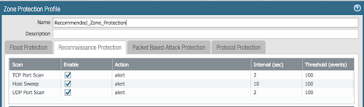

TCP Port Scan, Host Sweep, and UDP Port Scan are enabled in alert-only mode to monitoring without blocking. 

.. Note::
    Active blocking requires network tuning.

Network > Network Profiles > Zone Protection Profile > Recommended_Zone_Protection > Packet Based Attack Protection > IP Drop
+++++++++++++++++++++++++++++++++++++++++++++++++++++++++++++++++++++++++++++++++++++++++++++++++++++++++++++++++++++++++++++

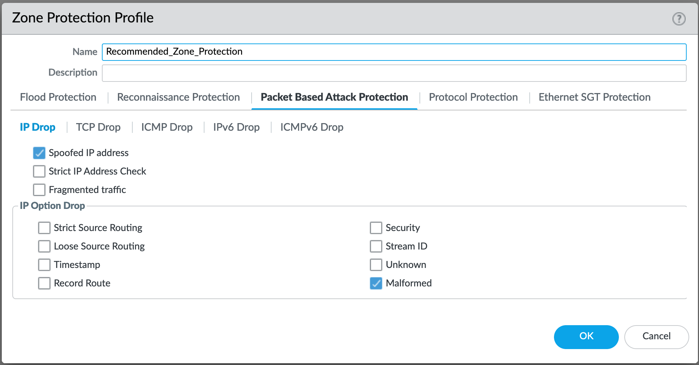

IP Drop settings enabled for a spoofed IP address and malformed packets.

Network > Network Profiles > Zone Protection Profile > Recommended_Zone_Protection > Packet Based Attack Protection > TCP Drop
++++++++++++++++++++++++++++++++++++++++++++++++++++++++++++++++++++++++++++++++++++++++++++++++++++++++++++++++++++++++++++++

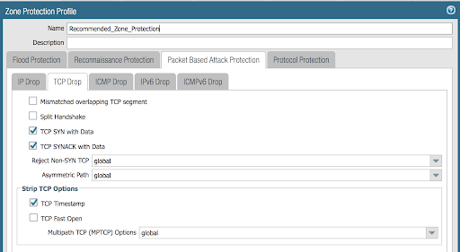

TCP Drop settings enabled for TCP SYN with Data, SYNACK with Data. Also to strip TCP Timestamp.

.. Note::
    These are explicit enables in the template to ensure not disabled across software versions.

Objects
-------

This section includes various profiles, objects, and tags used primarily in security and decryption policies.

Address
^^^^^^^

.. _Objects - Addresses: https://docs.paloaltonetworks.com/pan-os/9-0/pan-os-web-interface-help/objects/objects-addresses.html#

.. admonition:: See also

     General configuration information in the Admin Guide: `Objects - Addresses`_

IronSkillet Address Objects
~~~~~~~~~~~~~~~~~~~~~~~~~~~

Objects > Addresses : sinkholes
+++++++++++++++++++++++++++++++

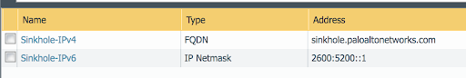

IronSkillet provides two address objects reference in security policies.
These are associated to the sinkhole addresses used in the :ref:`Anti-Spyware Profile` setting.

.. Note::
    8.x releases use type of IP Netmask whereas 9.0 requires an FQDN entry for the sinkhole address.

Tags
^^^^

.. _Objects - Tags: https://docs.paloaltonetworks.com/pan-os/9-0/pan-os-web-interface-help/objects/objects-tags.html

.. admonition:: See also

     General configuration information in the Admin Guide: `Objects - Tags`_

IronSkillet Tag Objects
~~~~~~~~~~~~~~~~~~~~~~~

Object > Tags : directionals and version
++++++++++++++++++++++++++++++++++++++++

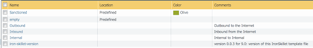

Reference tags used in security policies along with an ‘IronSkillet’ version tag.

    + **Outbound**: traffic from internal to external
    + **Inbound**: traffic from external to internal
    + **Internal**: internal-only traffic

.. Note::
    The iron-skillet-version tag is used for release tracking only.

Custom Objects
^^^^^^^^^^^^^^

.. _Objects - Custom Objects: https://docs.paloaltonetworks.com/pan-os/9-0/pan-os-web-interface-help/objects/objects-custom-objects.html

.. admonition:: See also

     General configuration information in the Admin Guide: `Objects - Custom Objects`_

User generated objects as placeholders.

IronSkillet Custom Objects
~~~~~~~~~~~~~~~~~~~~~~~~~~

Object > Custom Objects > URL Category
++++++++++++++++++++++++++++++++++++++

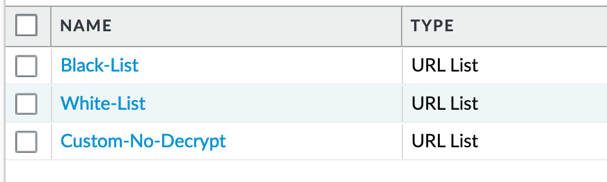

Placeholder for custom url categories used in security rules and url profiles.
Using these categories prevents the need to modify the default template.

    + **Black-List**: placeholder to be used in block rules and objects to override default template behavior
    + **White-List**: placeholder to be used in permit rules and objects to override default template behavior
    + **Custom-No-Decrypt**: to be used in the decryption no-decrypt rule to specify URLs that should no be decrypted

Security  Profiles
^^^^^^^^^^^^^^^^^^

.. _Objects - Security Profiles: https://docs.paloaltonetworks.com/pan-os/9-0/pan-os-web-interface-help/objects/objects-security-profiles.html

.. admonition:: See also

     General configuration information in the Admin Guide: `Objects - Security Profiles`_

Security profiles in IronSkillet are explicitly named using one or more of the following:

    + **Outbound**: traffic originating inside the network accessing external sites
    + **Inbound**: traffic originating outside the network accessing internal sites
    + **Internal**: traffic originating inside the network access other internal sites
    + **Exception**: user-defined profile that can be used without changing the base profiles
    + **Alert-Only**: alert-only for any traffic sessions; not recommended when blocking required

AntiVirus
~~~~~~~~~

Antivirus profiles to protect against worms, viruses, and trojans and to block spyware downloads.

Outbound, Inbound, and Internal AntiVirus (AV) profiles.

Object > Security Profiles > Antivirus : Blocking
+++++++++++++++++++++++++++++++++++++++++++++++++

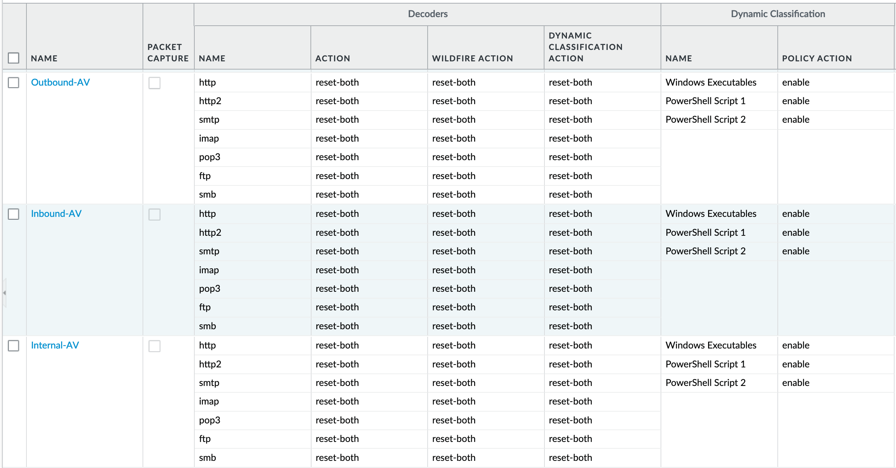

These are all explicitly set to reset-both for all decoders.

Object > Security Profiles > Antivirus : Alert-Only
+++++++++++++++++++++++++++++++++++++++++++++++++++

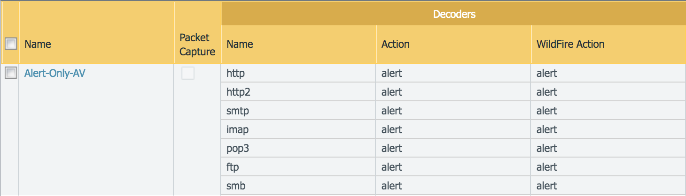

Sets all decoders to alert mode.

Object > Security Profiles > Antivirus : Exception
++++++++++++++++++++++++++++++++++++++++++++++++++

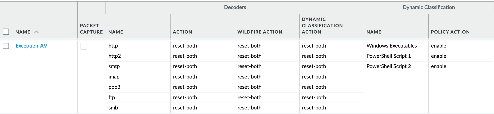

Set in blocking mode as default. This profile is a placeholder to be customized by the user and used in security
profile groups and policies without the need to edit the IronSkillet blocking profiles.

.. _Anti-Spyware Profile:

Anti-Spyware
~~~~~~~~~~~~

Anti-Spyware profiles to block attempts from spyware on compromised hosts trying to phone-home or beacon
out to external command-and-control (C2) servers.

Object > Security Profiles > Antivirus : Outbound-AS
++++++++++++++++++++++++++++++++++++++++++++++++++++

**Rules: Outbound Anti-Spyware (AS) and Inbound-AS profiles**

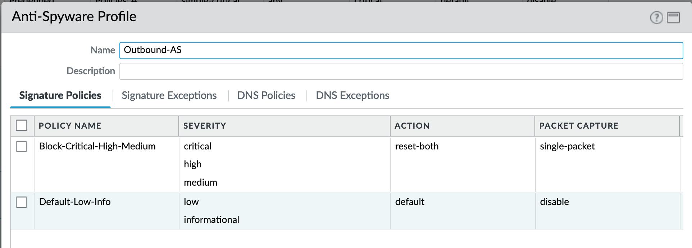

Rules block critical, high, and medium severity events. For low and informational, default is used.

.. Note::
    Only Outbound-AS is shown with Inbound-AS having an identical configuration.

**Exceptions: Checking Default Actions**

To see the actions for ‘default’, click into Exceptions and enable ‘Show all signatures’.
The Action column shows default actions for each ID.

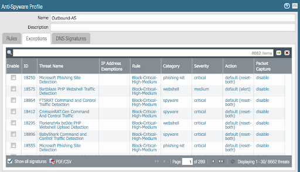

**DNS Signature: Sinkhole Malicious Domain Traffic**

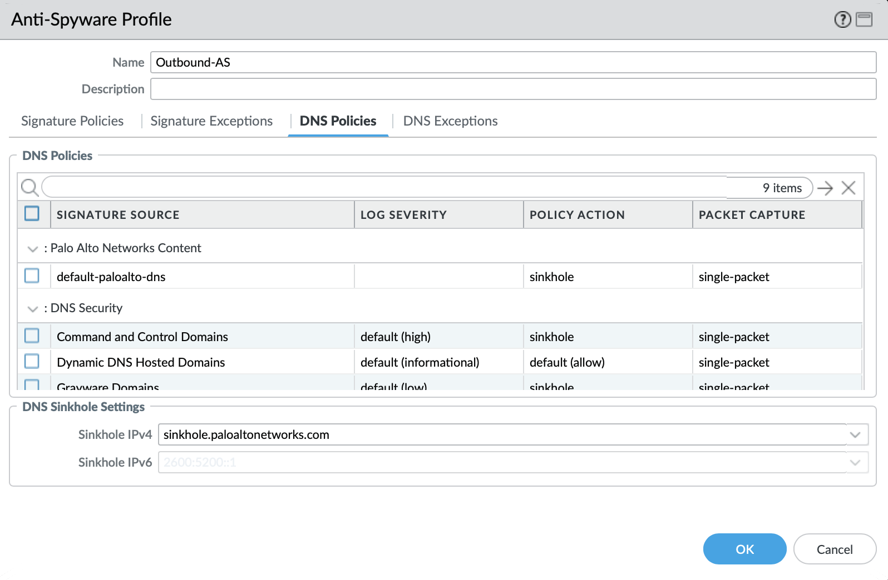

The profile also sinkholes malicious domains based on the sinkhole settings.
The settings map to the address objects and sinkhole redirects can be dropped as part of the security
policies if no sinkhole server is used.

.. Note::
    As of 9.0, instead of only leveraging a list of locally stored malicious domains (Content DNS Signatures),
    Palo Alto Networks also provides a DNS Security service subscription for cloud-based domain lookups.

Object > Security Profiles > Antivirus : Internal-AS
++++++++++++++++++++++++++++++++++++++++++++++++++++

The Internal profile shifts the medium severity to ‘default’ instead of reset both slightly lowering the
security posture for internal-only sessions.

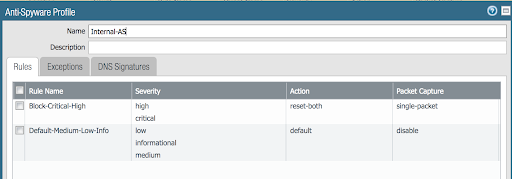

The DNS Signatures configuration is the same as Outbound-AS and Inbound-AS.

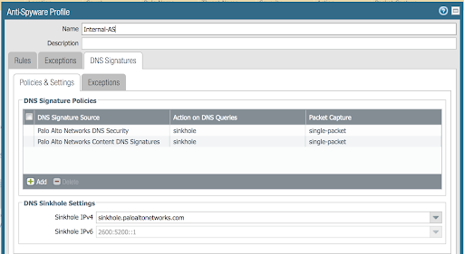

Object > Security Profiles > Antivirus : Alert-Only
+++++++++++++++++++++++++++++++++++++++++++++++++++

This is a non-blocking alert-only configuration that can be used for testing/demonstration purposes.

.. image:: images/vg_profiles_as_alert.png
   :width: 600
   :align: center

The malicious domain actions are also ‘alert’ for monitoring purposes only.

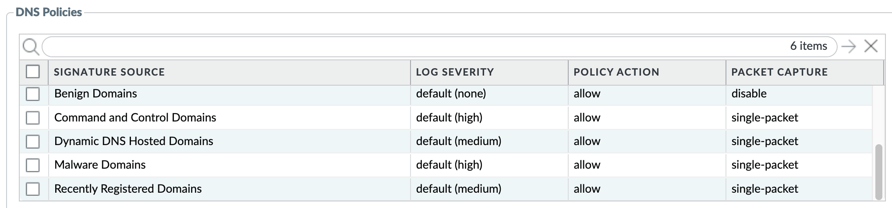

Object > Security Profiles > Antivirus : Exception-AS
+++++++++++++++++++++++++++++++++++++++++++++++++++++

This is a placeholder allowing for custom rules without editing the base template configuration profiles.
The exception placeholder contains no preconfigured rules.

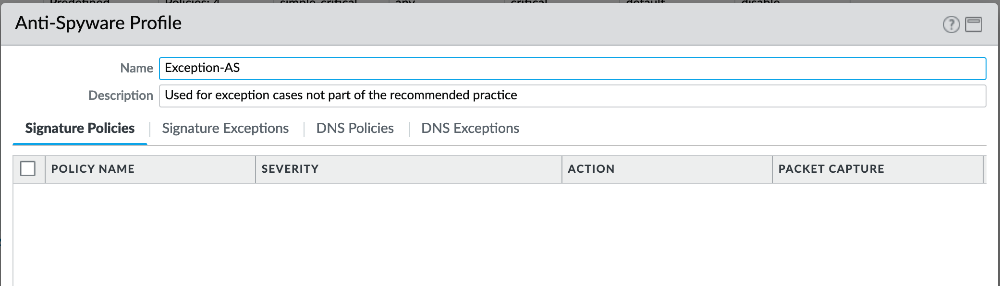

Vulnerability
~~~~~~~~~~~~~

Vulnerability protection profiles to stop attempts to exploit system flaws or gain unauthorized access to systems.

Object > Security Profiles > Vulnerability Protection : Outbound-VP
+++++++++++++++++++++++++++++++++++++++++++++++++++++++++++++++++++

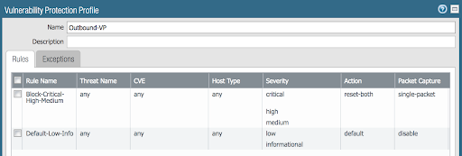

IronSkillet adds two rules:

    (1) reset-both for critical/high/medium severity events
    (2) the use of default actions for low and informational severities.

Object > Security Profiles > Vulnerability Protection : Inbound-VP
++++++++++++++++++++++++++++++++++++++++++++++++++++++++++++++++++

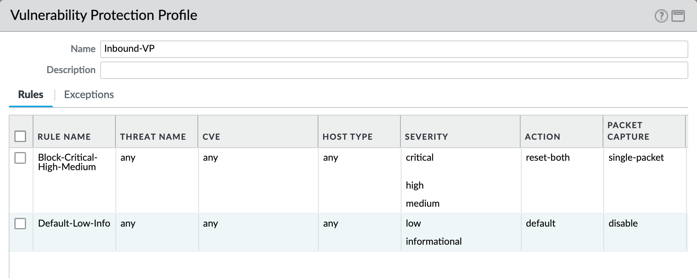

Currently identical to the above Outbound profile to block critical/high/medium and use ‘default’ for low
and informational severities.

Object > Security Profiles > Vulnerability Protection : Internal-VP
+++++++++++++++++++++++++++++++++++++++++++++++++++++++++++++++++++

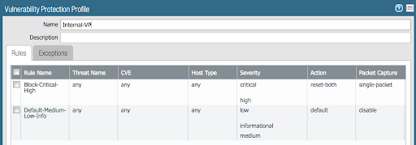

As with the Anti-spyware internal profile, medium is set as ‘default’ along with low and informational.
This adds some trust to internal-only communications.

Object > Security Profiles > Vulnerability Protection : Alert-Only-VP
+++++++++++++++++++++++++++++++++++++++++++++++++++++++++++++++++++++

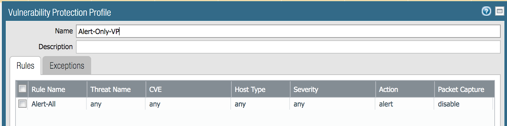

Alert-Only provides a monitoring-only profile for vulnerability events.
It is designed for use in demonstration or test deployments without active blocking.

Object > Security Profiles > Vulnerability Protection : Exception-VP
++++++++++++++++++++++++++++++++++++++++++++++++++++++++++++++++++++

.. image:: images/vg_profiles_vp_exception.png
   :width: 600
   :align: center

This profile is a placeholder only allowing a user to customize their own ruleset without modifying the
default IronSkillet profiles.

URL Filtering
~~~~~~~~~~~~~

URL filtering profiles to restrict users access to specific websites and/or website categories, such as shopping or gambling.

Object > Security Profiles > URL-Filtering
++++++++++++++++++++++++++++++++++++++++++

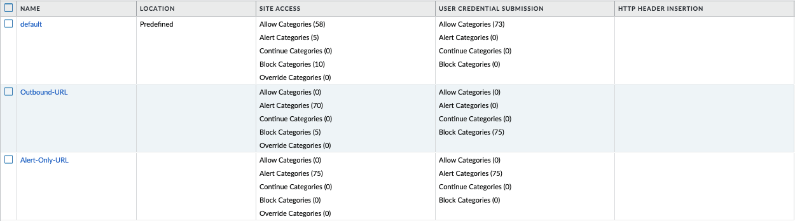

IronSkillet provides only 3 profiles for URL excluding the Inbound and Internal used in the other profiles.
The IronSkillet assumption is that only outbound requests may be accessing malicious sites.

Object > Security Profiles > URL-Filtering : Outbound-URL
+++++++++++++++++++++++++++++++++++++++++++++++++++++++++

**Categories: Site Access**

IronSkillet only blocks known malicious categories and not high risk categories such as copyright-infringement
mentioned in our Best Practice Assessment (BPA).

Categories blocked in the Outbound and Exception profiles:

    + Malware
    + Command-and-Control
    + Phishing
    + Hacking
    + Black-List [custom object users can edit]

All other categories have their action set as ‘alert’ instead of the default ‘allow’ for logging purposes.

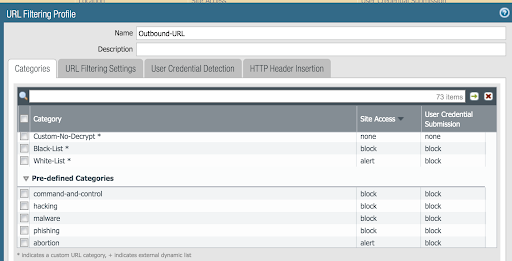

**Categories: User Credential Submission**

If you block all the URL categories in a URL Filtering profile for user credential submission,
you don’t need to check credentials.
IronSkillet takes this approach blocking all categories under User Credential Submission.

The Alert-Only-URL profile sets all actions to alert for logging purposes, include User Credential Submission.
No categories are blocked.

File Blocking
~~~~~~~~~~~~~

This set of profiles allow the NGFW to explicitly block files transiting the firewall by type and direction. 

Object > Security Profiles > File-Blocking
++++++++++++++++++++++++++++++++++++++++++

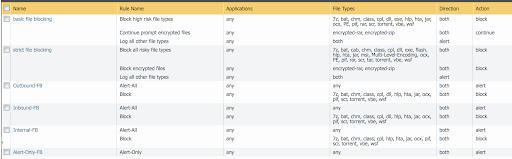

IronSkillet defines a day one perspective without variations in file blocking based on URL category, direction,
or application. File types that are not blocked are set as ‘alert’ for logging purposes.

The set of blocked file types represents the most common malicious file types that typically are not expected to
cross a security zone boundary. Other types are ignored (eg. exe) since these can be used for legitimate,
although not recommended, business purposes.

.. Note::
    Supported WildFire file types, even if blocked, will be sent to WildFire for analysis if Wildfire is
    license and configured in the device.

WildFire Analysis
~~~~~~~~~~~~~~~~~

WildFire™ analysis profiles to specify for file analysis to be performed locally on the WildFire appliance
or in the WildFire cloud. IronSkillet uses the cloud option.

Object > Security Profiles > WildFire Analysis
++++++++++++++++++++++++++++++++++++++++++++++

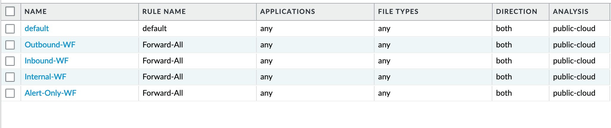

All profiles are set to send all file types for all applications in any direction to WildFire for analysis.

This configuration is for file analysis only. WildFire signatures and protections are configured in the
Anti-Virus profile. Below is the reference example for the Outbound-AV profile.

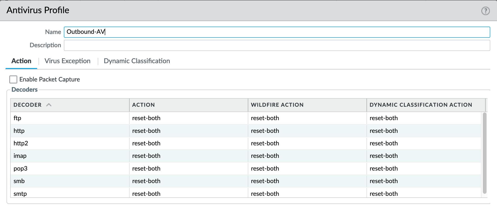

Based on the dynamic updates configuration, the device will check for new WildFire content updates based on
worldwide analysis every minute to download the latest five minute release. These signatures are moved to the
antivirus signature set on a daily basis for customers not subscribing to the WildFire service.

Security Profile Groups
^^^^^^^^^^^^^^^^^^^^^^^
.. _Objects - Security Profile Groups: https://docs.paloaltonetworks.com/pan-os/9-0/pan-os-web-interface-help/objects/objects-security-profile-groups.html

.. admonition:: See also

     General configuration information in the Admin Guide: `Objects - Security Profile Groups`_

In additional to individual profiles, you can combine profiles that are often applied together, and create Security
Profile groups. These can be referenced in a security profile without the need to explicitly reference each profile.

IronSkillet Security Profile Groups
~~~~~~~~~~~~~~~~~~~~~~~~~~~~~~~~~~~

Object > Security Profile Groups : all groups
+++++++++++++++++++++++++++++++++++++++++++++

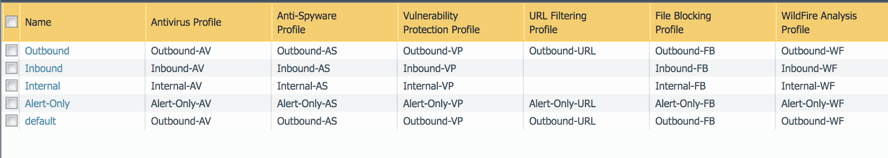

Each profile group is associated to the set of profiles reference the same direction or ‘alert’ mode.

The default profile, based on the Outbound security profiles, is created so that new security policies
can easily reference this default profile group.

IronSkillet does not reference the security profile objects since IronSkillet does not have explicit allow rules.

Log Forwarding
^^^^^^^^^^^^^^
.. _Objects - Log Forwarding: https://docs.paloaltonetworks.com/pan-os/9-0/pan-os-web-interface-help/objects/objects-log-forwarding.html

.. admonition:: See also

     General configuration information in the Admin Guide: `Objects - Log Forwarding`_

Sets up log forwarding profiles referenced in security policies.

IronSkillet Log Forwarding
~~~~~~~~~~~~~~~~~~~~~~~~~~

Object > Log Forwarding : default
+++++++++++++++++++++++++++++++++

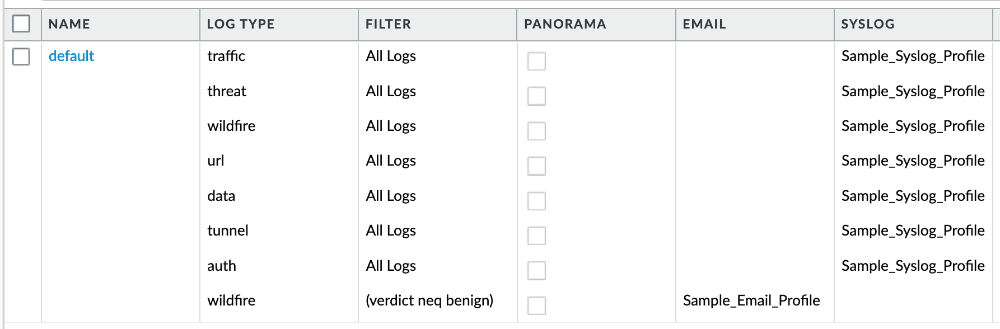

IronSkillet sets all log events to be sent to Syslog. Any malicious or phishing WildFire verdicts are emailed using
the Threat Alert email profile. The Panorama associated configuration sends log to Panorama.
Users can modify the default logging profile to send logs to additional locations as required.

The ‘default’ naming is used so that new security rules will automatically pick up this logging profile.

Decryption
^^^^^^^^^^
Decryption profiles enable you to block and control specific aspects of SSL and SSH traffic that you have specified
for decryption, as well as traffic that you have explicitly excluded from decryption. After you create a decryption
profile, you can then add that profile to a decryption policy; any traffic matched to the decryption policy is
additionally enforced based on the profile settings.

Decryption Profile
~~~~~~~~~~~~~~~~~~

.. _Objects - Decryption Profile: https://docs.paloaltonetworks.com/pan-os/9-0/pan-os-web-interface-help/objects/objects-decryption-profile.html

.. admonition:: See also

     General configuration information in the Admin Guide: `Objects - Decryption Profile`_

Object > Decryption > Decryption Profile : Recommended_Decryption_Profile
+++++++++++++++++++++++++++++++++++++++++++++++++++++++++++++++++++++++++

The Recommended_Decryption_Profile is provided to set several baseline, recommended profile elements.

Decryption Profile > SSL Decryption : SSL Forward Proxy
+++++++++++++++++++++++++++++++++++++++++++++++++++++++

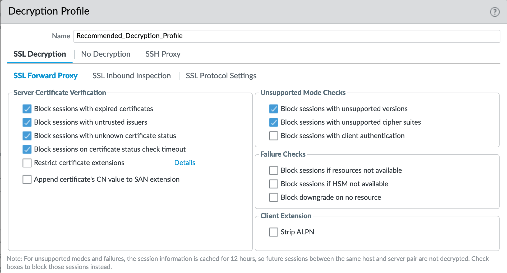

If using SSL Forward Proxy, block sessions with invalid certs and versions.

Decryption Profile > SSL Decryption : SSL Protocol Settings
+++++++++++++++++++++++++++++++++++++++++++++++++++++++++++

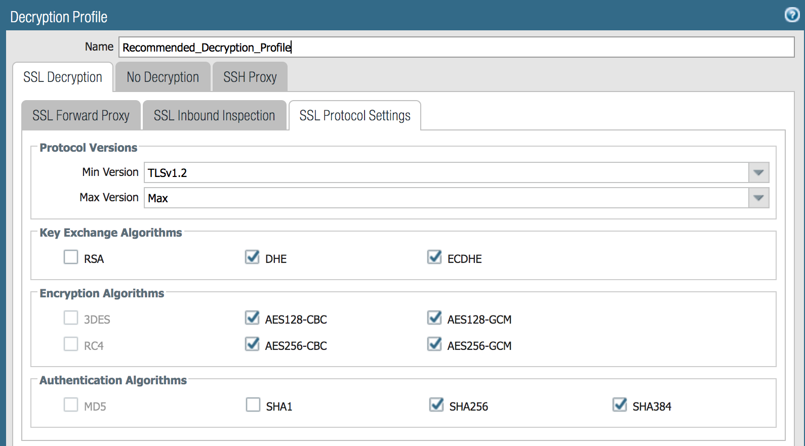

Protocol versions: Set the minimum protocol version to TLSv1.2. Any TLSv1.1 errors can help find outdated TLS endpoints

**Encryption Algorithms**: 3DES and RC4 not recommended and unavailable when TLSv1.2 is the minimum version.
**Authentication Algorithms**: MD5 not recommended and unavailable when TLSv1.2 is the minimum version

Decryption Profile > No Decryption
++++++++++++++++++++++++++++++++++

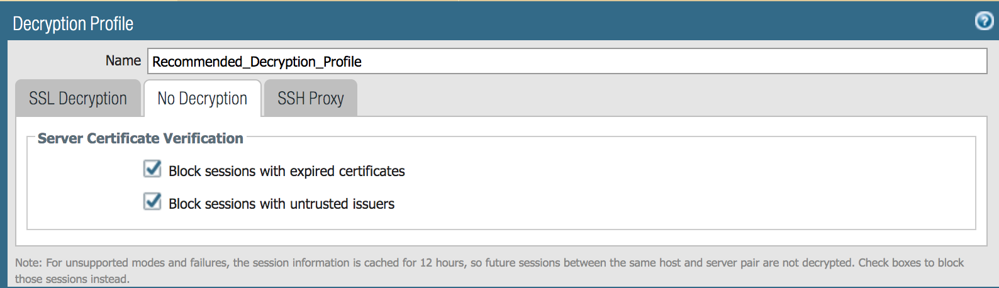

Even without decrypting, the recommended profile can block session with invalid certs or untrusted issuers.

Policies
--------

Security
^^^^^^^^
.. _Policies - Security: https://docs.paloaltonetworks.com/pan-os/9-0/pan-os-web-interface-help/policies/policies-security.html

.. admonition:: See also

     General configuration information in the Admin Guide: `Policies - Security`_

IronSkillet Security Policies
~~~~~~~~~~~~~~~~~~~~~~~~~~~~~

IronSkillet only provides suggested block rules and no traffic passing allow rules. When admins add new security rules,
they should reference the security profile groups and logging profile configured under Objects.

Policies > Security : edl and sinkhole
++++++++++++++++++++++++++++++++++++++

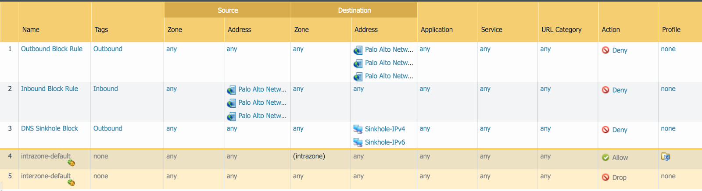

**Inbound and Outbound Block Rules**
Recommended Deny rules using the Palo Alto Networks predefined external dynamic lists (EDLs).

From Objects > External Dynamic Lists:

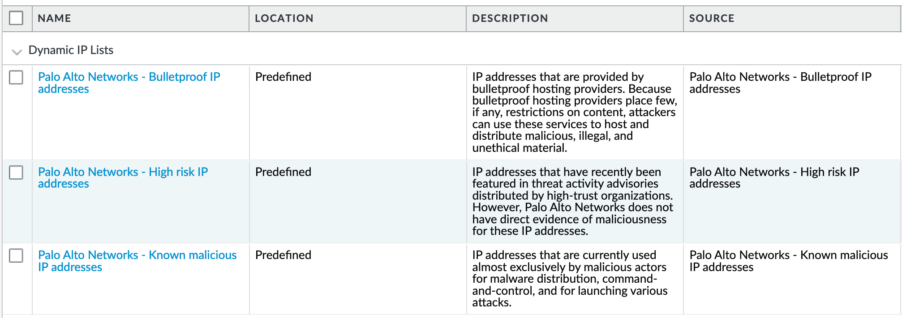

These external dynamic lists (EDLs) require a threat subscription and content update. Before configuring these security rules, the user
needs to ensure that the EDLs show up under Objects - External Dynamic Lists. If not present, either the subscription
is not valid or the content update has not been performed.

**DNS Sinkhole Block**
This policy rule lets the firewall drop sinkhole redirected traffic as defined in the Spyware object profiles.
DNS lookups matching a malicious domain will be sinkholed.

If the admin chooses to allow the traffic to pass to a legitimate sinkhole, this rule can be disable or removed.

Decryption
^^^^^^^^^^

.. _Policies - Decryption: https://docs.paloaltonetworks.com/pan-os/9-0/pan-os-web-interface-help/policies/policies-decryption.html#

.. admonition:: See also

     General configuration information in the Admin Guide: `Policies - Decryption`_

IronSkillet Decryption Policies
~~~~~~~~~~~~~~~~~~~~~~~~~~~~~~~

The IronSkillet decryption policies contain two rules: (1) An optional no-decrypt URL category rule to bypass
recommended URL categories when SSL decrypt is enabled and (2) a default NO-Decrypt rule that only provides cert
validation checks according to the Recommended_Decryption_Profile.

Neither of the two rules perform any decryption but rather validate the encrypted sessions (SSL/SSH)
meet particular integrity and encryption standards.

Policies > Decryption : no decrypt
++++++++++++++++++++++++++++++++++

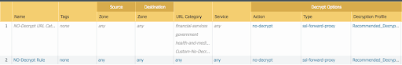

SSL Decryption is highly recommended to gain visibility to traffic sessions yet is not part of the IronSkillet
configuration template due to various requirements around certificates and application testing before full
implementations. Therefore as a Day One broad usage template, SSL decrypt is bypassed with only reference rules and profiles.

Monitor
-------

Manage Custom Reports
^^^^^^^^^^^^^^^^^^^^^

.. _Monitor - Custom Reports: https://docs.paloaltonetworks.com/pan-os/9-0/pan-os-web-interface-help/monitor/monitor-manage-custom-reports.html

.. admonition:: See also

     General configuration information in the Admin Guide: `Monitor - Custom Reports`_

IronSkillet Custom Reports
~~~~~~~~~~~~~~~~~~~~~~~~~~

IronSkillet includes a small set of custom reports aimed at SecOps practices and discovering malicious behavior.
These can be used as a reference for additional custom reports.

Monitor > Manage Custom Reports
+++++++++++++++++++++++++++++++++++

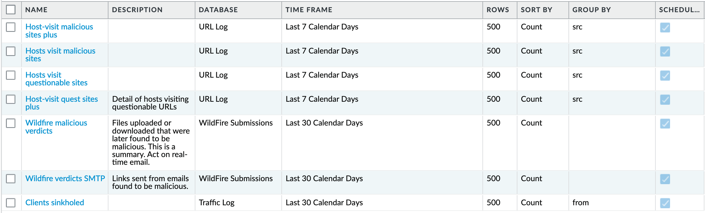

Monitor > Management > Custom Reports > Host-visit malicious sites plus
+++++++++++++++++++++++++++++++++++++++++++++++++++++++++++++++++++++++

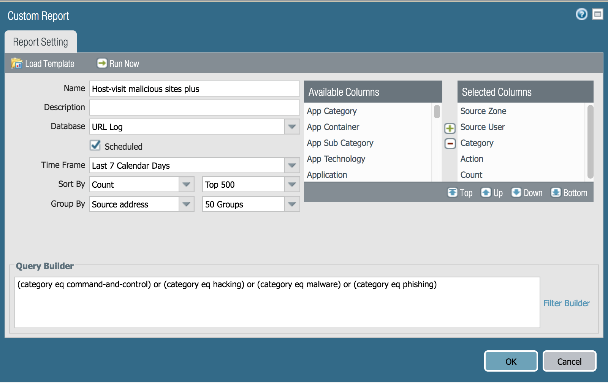

A weekly report to identify over the past seven days the following categories:

    + Command-and-control
    + Hacking
    + Malware
    + Phishing

Monitor > Management > Custom Reports > Host-visit malicious sites
++++++++++++++++++++++++++++++++++++++++++++++++++++++++++++++++++

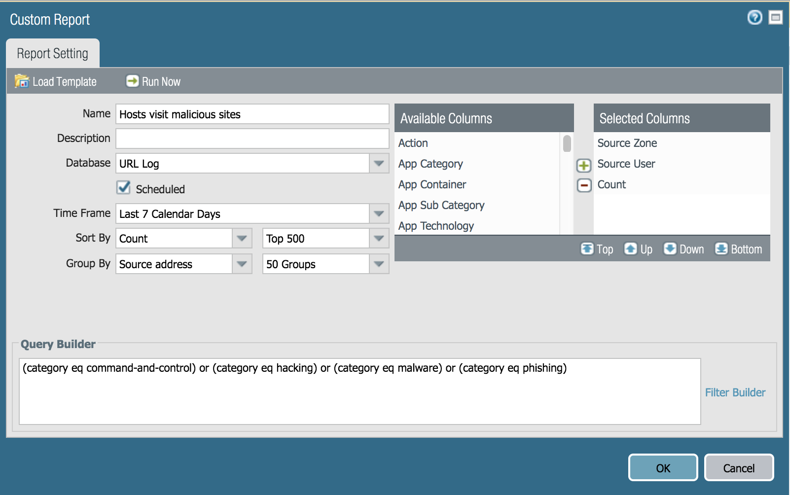

Same categories as previous report with fewer columns to simplify output

Monitor > Management > Custom Reports > Hosts visit questionable sites
++++++++++++++++++++++++++++++++++++++++++++++++++++++++++++++++++++++

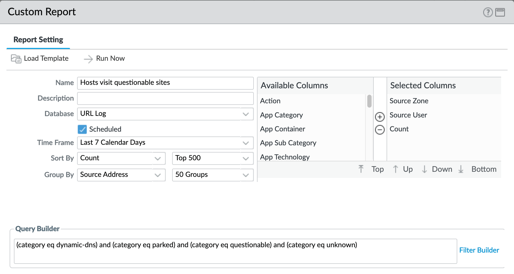

A weekly report to identify over the past seven days the following categories

    + Dynamic-dns
    + Parked
    + Questionable
    + Unknown

Monitor > Management > Custom Reports > Host-visit quest sites plus
+++++++++++++++++++++++++++++++++++++++++++++++++++++++++++++++++++

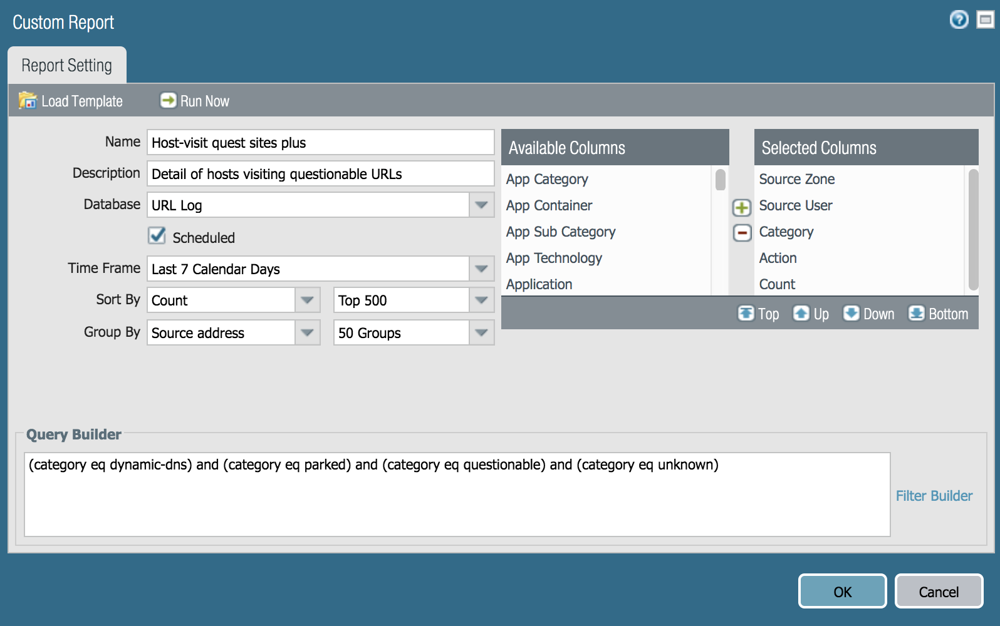

.. Note::
    'questionable' was concatenated to meet name length requirements

Same categories as previous report with more columns as an extended view

Monitor > Management > Custom Reports > Wildfire malicious verdicts
+++++++++++++++++++++++++++++++++++++++++++++++++++++++++++++++++++

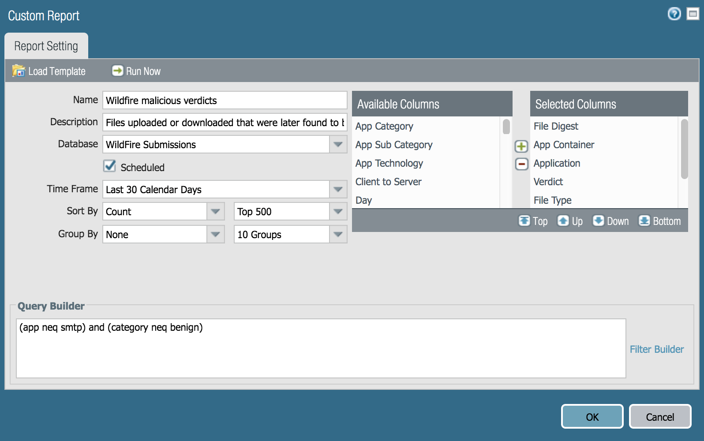

Report viewing all grayware and malicious verdicts

    + Minus smtp (SMTP in separate report)
    + Minus benign (only grayware and malicious)

Monitor > Management > Custom Reports > Wildfire verdicts SMTP
++++++++++++++++++++++++++++++++++++++++++++++++++++++++++++++

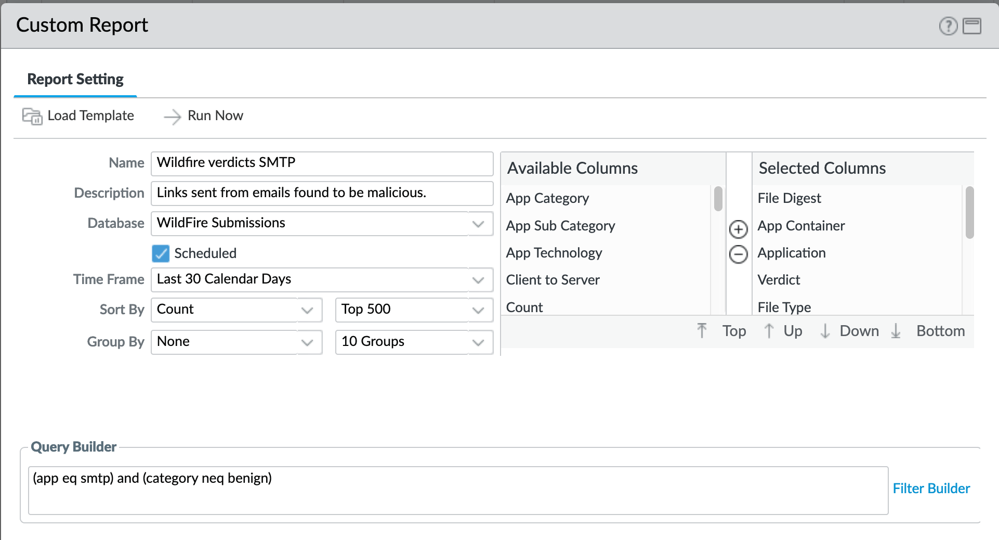

Report viewing all grayware and malicious verdicts

    + Only SMTP traffic
    + Minus benign (only grayware and malicious)

Monitor > Management > Custom Reports > Clients sinkholed
+++++++++++++++++++++++++++++++++++++++++++++++++++++++++

.. image:: images/vg_reports_clients_sinkholed.png
   :width: 600
   :align: center

The importance here is we are viewing the verdict based on a rule.
Reason being that if you go to threat log and say (action eq sinkhole) it will give you the DNS server and not the culprit.
This rule allows for identification of the compromised client.

PDF Reports
^^^^^^^^^^^

.. _Monitor - PDF Reports: https://docs.paloaltonetworks.com/pan-os/9-0/pan-os-web-interface-help/monitor/monitor-pdf-reports.html

.. admonition:: See also

     General configuration information in the Admin Guide: `Monitor - PDF Reports`_

Report Groups
~~~~~~~~~~~~~

The set of recommended reports and grouped as ‘Possible Compromise’ for review and email distribution.

Monitor > PDF Reports > Report Groups
+++++++++++++++++++++++++++++++++++++

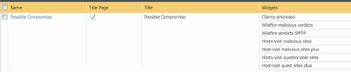

Email Scheduler
~~~~~~~~~~~~~~~

The report group ‘Possible Compromise’ is set up to be emailed using the referenced email profile as part of the device settings.

Monitor > PDF Reports > Email Scheduler
+++++++++++++++++++++++++++++++++++++++

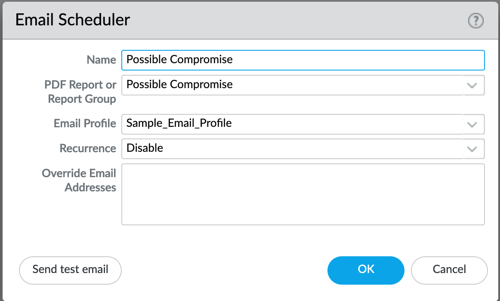

It is up to the user to finalize configuration by setting the recurrence for how often the email should be generated and sent.

